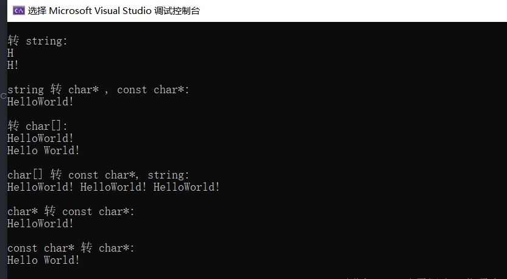
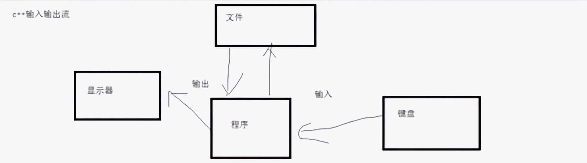
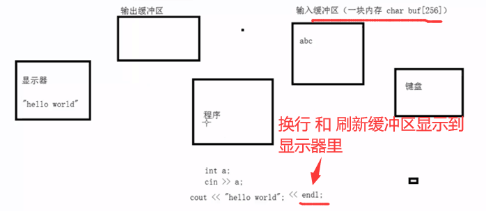
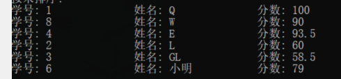
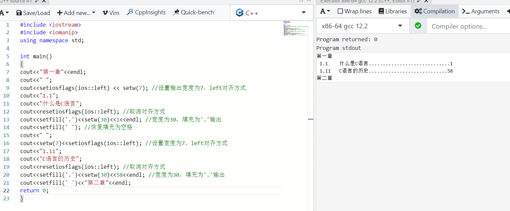
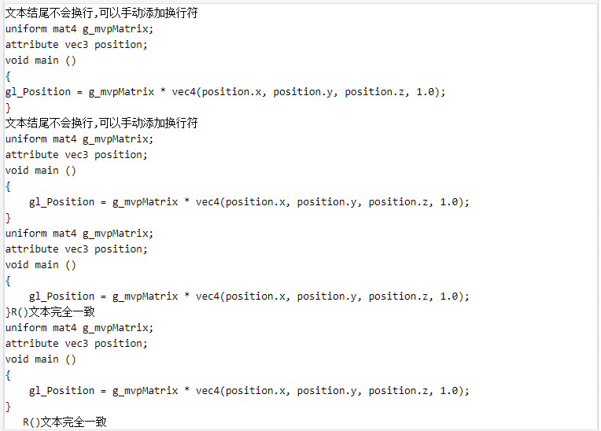
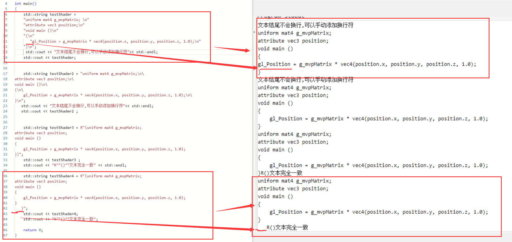

#  一 、c风格(char型)

## 1 . 基础

存储字符串有两种形式：

+ 字符数组形式：char str[20];
+ 字符指针形式：char* pc;

字符常量:  

+ 使用单引号 如:  's' 对应ascii码的83.    注意: "s" 实际上表示所在的地址. 
+ 严格意义来说字符就是   特殊字符 + 0-9数字字符 + 英文大小写字符   **不如 不能定义字符' 77 '**
+ ‘\0'是字符数组里的结束标志，库中的strcpy在复制完字符串时给你加上了'\0'结束符，所以不须要你再添加。而如果是你对字符数组操作时就要加，比如你把A串的字符复制给B，B[i++] = A[j++];复制完最后一个时你就要加上'\0'。B[i]=0;/B[i] = '\0'；

---------------

[字符数组](ht)：存储字符的数组,**表示字符只能用单引号**  如: 'y'

[字符串](http) ：是使用最频繁的字符数组，是**一个特殊的字符数组,**  **字符串的结尾有一个字符\0,**表示字符串的结束。

字符串的优势在于输入/输出和赋初值/输入输出不需要使用循坏。   字符数组需要用循环依次输出每个字符。

----------

**char 可以定义字符数组，也可以定义字符串 :**

+ char 定义字符数组

```c++
char b[]={'h','e','l','l','j'};          //声明字符数组， 不加数字表示自动根据初值个数确定数组长度  只有初始化才能这样
----
char c[3];   
c[0]= 'I′;
c[1]= 'a';
c[2]= 'v′;
```

注意: char 字符数组可以放整数的

**第一种情况：**

char字符占用一个字节，本身就是以整数表示； char可以表示-128-127， unsigned char 0-255;

**第二种情况：**

你想把 int 类型存放到char 数组，这也是可以的，只要数组有足够的内存；

比如一般int 占 4个字节，要存储它至少定义char num[4]；

比如 int a = 500;  char num[4]; 

可以通过memcpy(num, &a, sizeof(int)), 这样就把整形变量写入了char的num数组里。

+ char  定义字符串

```c++
char b[]={'h','e','l','l','o','/0'};    //声明字符串,字符串的结尾有一个字符\0,
-----
char b[]="hello";      //定义字符串,用双引号括起, '/0'计算机去完成
char *p = b;
cout << b;           // 输出的是hello
cout << *p;          // 指针指向首地址，所以输出为 h
cout << p            // 输出整个字符串
    
//常量字符串:
const char *p = "Hello world";  //字符指针变量初始化方式
char *p = "Hello world";  // 也属于字符串常量
```

```c++
//可以操过创建的数组长度的
#include <iostream>
#include <cstring>

int main(void)
{
    char a[3];
    std::cout << "1:----";
    std::cin >> a;
    std::cout << a << std::endl;
    std::cout << sizeof(a) << std::endl;
    std::cout << std::strlen(a);

}

//结果:
PS C:\Users\16658\Desktop\ctest\12.5> .\a.exe    
1:----123456
123456
3  // 定义的数组长度
6  // 数组可见长度
    
   ---------------------------------------------------------- 
    // 数组可见长度 可以大于 定义的数组长度的,计算机不会保错的
    // 先要确保不大于 方法:
    // 输入成功并且超过定义的数组最大值进行忽略(一般整行输入可能超过)
    cin.get(a, size);
    while (std::cin && std::cin.get() != '\n')  // 丢掉超过定义数组长度的字符串
        continue;
```

##  2. 遍历char字符串

只能遍历, 得到元素, 因为本质是数组

以下都对

```c++
//法1
while (p[i] != '\0')    // 遍历整个字符串
{          
    i++;
} 

//法2
// strcpy的实现就是用的这个
while (*p != '\0')
{
    p++;                  //指针的运算--->索引的移动
} 

//法3
char ch[] = "dsasadf";
for (int i = 0; i < strlen(ch)l i++)
{
    cout << ch[i];
}

------------
char ch[] = "dsasadf";
char *p = ch;
//可以使用printf("%s", p);得到  //不能直接printf("%s", *p)得到
while (*p)
{
    printf("%c", *p);
    p++;
}
```

**打印字符串,    通过首地址打印**

```c
char *p = "dshgh";
// // std::cout << *p;
// std::string s = "sfdjaj";
printf("%s", p);
```

## 3. 常用函数

==需要头文件 <cstring>  命名空间std==        

1. size() 计算类型长度, 一般不用

   

2. **sizeof()   计算整个数组的长度**   

   + 注意:  sizeof是无符号的 , 要使用正负 需要强转

   + 延申:    

     ```c++
     字节数:  sizeof(类型) * 元素个数
     
     字符串长度: sizeof(name)  字符串文本写入时长度计算使用strlens，二进制写入时使用sizeof
         
     数组长度:  arr只能是数组名
     一维:
     int len = sizeof(arr) / sizeof(int);
     二维:
     int row = sizeof(arr)/sizeof(arr[0]);
     int col = sizeof(arr[0]) / sizeof(int);
     //记忆 二维数组名的是 一维指针数组的大小 理解成 一行
     
     结构体大小:
     sizeof(struct Person)
     注意: memcpy时用sizeof(结构体具体对象名字)
         
     结构体数组长度:
     int len = sizeof(personArr) / sizeof(struct Person);
     ```

     

3. **strlen()**计算可见字符的长度,**并不把'/0'计算在内**

   ```c++
   字符串设置的长度是可见字符数目 + 1及strlen()+1 因为包含了\0结束符至少要留出一个计算机 ，而字符数组的长度就是字符的数目。
   ```

   

4. **strcpy(s1,s2)**   	拷贝字符串 s2 到字符串 s1   (因为**数组不能直接赋值**),   

   + 是指针一般还要和new连用, 
   + 是 char[] 一般也直接用
   + **先清空, 重新分配内存 , 再赋值**

   ```c++
   // ch的字符串 s1 _ch是字符串 s2 
   
   // 1.先清空
   if (ch != NULL)
   {
       delete ch;
       ch = NULL;   
   }
   // 2.重新分配内存
   len = std::strlen(_ch);
   ch = new char[len + 1];
   // 3再赋值
   std::strcpy(ch,_ch);
   ```

   

5. strncpy (拷贝到位置 , 起始,  个数)  strncpy为拷贝n个  [字符串到目标数组，目标数组应比n要大]

   拷贝字符串用`strncpy()`函数更加安全

   

6. **memcpy**(str1, cstr2, size_t n)    **str2** -- 指向要复制的数据源， **n** -- 要被复制的字节数。   //从前开始覆盖原有部分数据:    **常用于内存之间的拷贝 **比如拷贝数组

   ```c++
   //注意 1. new和new[]的区别
   // new 用于单个对象或实例的创建，就是调用类的构造函数。
   // new [] 用于创建对象或实例的数组实例，并且地址是连续的。(内存分配的时候有可能不连续，但地址链表是连续的。)
   
   char * temp = new char[eleSize];   //用char * temp = new char会报错   
   // 交换元素
   // memcpy 用于内存之间的拷贝
   memcpy(temp, pJPlus, eleSize);
   memcpy(pJPlus, pJ, eleSize);
   memcpy(pJ, temp, eleSize)
   ```

   ```c++
   memcpy(temp, pJPlus, sizeof(pJPlus);  赋值整个数组
   ```

   

   ```c++
   int temp[5];
   memcpy(temp, arr, sizeof(int)*5);
   
   // each
   for (int i = 0; i < 5; i++)
   {
   	printf("%d ", temp[i]);
   }
   ```

   

7. **memcmp  ** 内存比较，不仅可以比较字符串，还可以比较其他的内存

    **比较的是第一个不同数据的大小**

   进行比较的数据源要转换成指针        **n** -- 要比较的的字节数:  sizeof(类型) * 元素个数

   ```c++
   int arr[5] =  { 1,2,6,4,5};
   int arr1[5] = { 1,2,5,4,5 };
   int ok = memcmp(arr, arr1, sizeof(int) * 5);   // 比较前面的5个
   int ok1 = strcmp(arr, arr1);
   printf(" %d\n", ok, ok1)
       
   结果:
   1
   ```

8. **memset** 按字节对内存进行初始化  

   **常用来字符串清零,   或者一维指针数组用来置0操作,  整个结构体置0**  这里的0包括nULL 和 "  "

   注意结构体中用来string不能使用memset

   ```c++
   char str[5] = "dsaasd"
   memset(str, 0, sizeof(str));   //数组可以用这个得到整个数组的字节数
   ```

   ```c++
   char num[5];
   memset(num, 127, sizeof(char) * 5);
   // or memset(num, 127, sizeof(num));
   for(int i = 0; i < 5; i++)
   {
   	printf("%d ", num[i]);
   }
   ```

   

9. **strcat(s1,s2)	   连接字符串 s 2 到字符串 s1 的末尾**

   ```c++
   char dest[20]="hello ";
   strcat(dest, "maye");
   puts(dest);             // hello maye
   ```


10. strlen(s1)	         返回可见字符串 s1 的长度**   ==重要==


11. **strcmp(s1,s2)**	   返回s1与s2的比较结果,  **比较的是第一个不同字符的ascll码 **

     **这里 ,  char[] 和 char * 可以比较的**     // **一般char 的数组进行比较的话都必须用这个进行比较**

       补充ascll码值:  记忆  48 , 65 97大小写字符相差32

    int strcasecmp (const char *s1, const char *s2);

    ```c++
    strcmp(s1，s2)
    当s1<s2时， 返回值 <0；
    当s1==s2时，返回值 =0；
    当s1>s2时， 返回值 >0。
        
    int strncmp(const char *str1, const char *str2, size_t n)
    - 如果返回值 < 0，则表示 str1 小于 str2。
    - 如果返回值 > 0，则表示 str2 小于 str1。
    - 如果返回值 = 0，则表示 str1 等于 str2。
    ```

    ```c++
    char b[] = "111a";
    char c[] = "111c";
    
    //char b[] = "1";  66
    //char c[] = "c";  98
    if (strcmp(b, c) > 0)
        printf("b");
    else
        printf("c");
    //结果都是:
    c
    ```

    ```c++
    #include <stdio.h>
    #include <string.h>
    
    
    int main(void)
    {
    	char name[8][10] = {
    		"maye",
    		"多方行",
    		"winter",
    		"se",
    		"运动",
    	};
    
    	for (int i = 1; i < 5; i++)
    	{
            if (strcmp(name[i], name[i - 1]) < 0)
            {
                char t[10] = {0};
                strcpy(t, name[i]);
                strcpy(name[i], name[i - 1]);
                strcpy(name[i - 1], t);
            }		
    	}
    
    	// each
    	for (int i = 0; i < 5; i++)
    	{
    		puts(name[i]);
    	}
    
    	return 0;
    }
    
    // 结果
    maye
    winter
    se
    多方行
    运动
    ```

       

12. **strchr(s1,ch)	     在字符串中查找字符val返回一个指针，存在返回val的，指向字符串s1中字符ch的第一次出现的位置**，没有返回NULL

    ```c++
    // 原型 char *strchr(const char *str, int c)
    
    const char str[] = "http://www.runoob.com";
    const char ch = '.';
    char *ret;
    ret = strchr(str, ch);
    //结果:  .runoob.com
    -----------------
        
    //用处:
    //heroId: 100
     char *  pos = strchar(buf, ":");
     strncpy(config[index].key, buf, pos - buf)  // buf-->heroId: 100\n  // pos-->: 100
     strncpy(config[index].key, pos+1, strlen(pos + 1) - 1) // pos--> 100  //-1不要换行
    ```

    

13. **strstr(s1,s2)	     在字符串中查找子串substr返回一个指针，指向字符串s1中s2的第一次出现的位置**

    ```c++
    char words[] = "hello every one,My name's maye";
    puts(strstr(words, "one"));
    
    //结果:
    one,My name's maye
    ```


++++

##  4.  **指针与字符数组、  指针与字符串 和 储存多串字符串**

- [x] 指针指向  字符数组

```c++
char b[] = { 'h','e','l','l','o' };   // 字符数组

char *pchar = b;   //它是指向字符串的首个字母 
cout << *pchar;   //该语句输出 h
//cout << b;      //不要用这个方式输出，输出的是 hello加一些乱码字
cout << b[0];     //该语句输出 h

//指针访问每个字符并输出 hello
for (size_t i = 0; i < 5; i++)
{
        cout << *pchar;
        pchar++;
}
```


- [x] 指针指向  字符串

```c++
char str[] = "we are poor";    // 字符串

char *p = str;            //它是指向字符串的首个字母 
cout << *p;   //该语句输出 w
cout << p[0];     //该语句输出 w

//指针访问每个字符并输出  we are poor
while (*p != '\0')
{
    cout << *p;
    p++;                  //指针的运算--->索引的移动
} 
```

- [x] 储存多串字符串

```c
char* str1[5];
for (int i = 0; i < 5; i++)
{
	str1[i] = malloc(10);
	gets_s(str1[i],10);
}
```

## 5.  遇到char* 必须用new  +  strcpy()

**char * 的基础知识 : **

+ **可以指向 字符串的指针(其实严格来说，它是指向 字符串的==首个字母==)** 取地址   得到的是**字符数组首地址 **即&ps[0].

+ **可以指向  一串常量字符串 (一般用const char*) :**

+ ```c++
  char *p;
  p="Hello world";
  -------
  char *p = "Hello world";  //字符指针变量初始化方式
  
  //一般会加const使用:
  const char *p = "Hello world";  // c++要加
  cout << p;  // 打印
  ```

--------------

**方法1 ;   要添加 < cstring > 头文件** 

通过     **普通数组  +  strncpy()函数**

```c++
#include <cstring>
class A
{
	char ch[20];
public:
	A(char* _ch):ch(_ch) {}
}

A(char* _ch)                
{
	std::strncpy(ch,_ch, 20);   // strncpy(ch,_ch, 20) 第三个参数 要cp多少个过去
    if (strlen(nm) >= 20)
        name[19] = '\0';   // 新数组的最后一个元素应该是空
}   
```

通过    **对类属性**  **使用动态数组(指针)  + strcpy()函数**

```c++
#include <ctring>   
class A
{
	char* ch;
public:
    A();
	A(cosnt  char* _ch);
    //一定要有一个delete [] array_name  // 释放数组开放的内存
    ~A(){ delete []ch; }
}

//默认构造
 A()
 {
    ch = new char[10];
	std::strcpy(ch, "哈哈");
 }
// 一级指针 就ok 相对于按值 所以一般都会加const
A(cosnt char* _ch)                
{
    //核心:
    ch = NULL // 先置空  (可选)
    len = std::strlen(_ch);
    ch = new char[len + 1];
	std::strcpy(ch,_ch);
}   

```

**方法2 : 也可以直接改用string类**

```c++
#include <string>     // 不是string
class A
{
	std::string ch;
public:
	A(cont std::string & ch_):ch( ch_ ) {}
}
```

**对非类属性:** 

用一级指针 只能算是按值拷贝

需要二级指针  算按指针传递

+++++

```c
//对函数调用而言 : 
void allocateSpac2(char ** pp)
{
    char * temp = malloc(100);
    memset(temp, 0, 100);
    strcpy(temp, "hello world");
    *pp = temp;
    printf("aaa%s\n", *pp);   //"hello world"
}


void test03()
{
    char * p = NULL;
    allocateSpac2(&p);
    printf("%s\n", p);    //"hello world"
}
```

## 6. const char*  问题:

**`指针指向的是一个const* char类型， 即不能通过当前的指针对字符串的内容作出修改`**

#### 一 : 注意const的两个概念：

​       char * const   [指向字符的  静态指针]
​       const char *    [指向静态字符  的指针]   它的意思是指针指向的内容是不能被修改的

**前者const修饰的是指针，代表不能改变指针**
**后者const修饰的是char，代表字符值不能改变，但是指针可以变，也就是说该指针可以指针其他的const char。**

**const变量是不能修改本身但是可以 赋值 给 另一个变量**

#### 二:指针的赋值之间的关系:

即非const指针  不能指向(接受)const数据（数据为非指针类型）。

即const指针     既可以指向(及**把const或非const数据的地址赋给const指向的指针是可以的**)const数据又可以指向非const数据（**数据为非指针类型**）。 最好是对应更严谨

==能这样做的原因 : 传递的实参时候是 数组而数组名就是地址==

二级间接关系中，需要注意const指针的赋值。

## 7. char * name = ""和 char * name = " "的区别

<font color = red>一般不要写这种, 写char name[10]; 或者 char * name;</font>

1. `char * name = "";` 表示将一个空字符串赋值给指针 `name`。空字符串是由两个连续的空字符 `\0` 组成，代表了一个空的字符串。
2. `char * name = " ";` 表示将一个由一个空格字符组成的字符串赋值给指针 `name`。这个字符串包含一个空格字符和一个结束字符 `\0`，它代表了一个只有一个空格的字符串。

总结：两者的主要区别在于，前者是一个完全空的字符串，而后者是一个空格字符构成的字符

#  二 、 c++风格(string容器)

**string的特性**

和char*类型的字符串的对比:

+ **Char*是一个指针，String是一个类**
  + string封装了char*，管理这个字符串，是一个 char*型的容器。*
+ **String封装了很多实用的成员方法**
  + 查找find，拷贝copy，删除delete替换replace，插入insert
+ **不用考虑内存释放和越界**
  + string管理char*所分配的内存。每一次string 的复制,取值都由string类负责维护
    不用担心复制越界和取值越界等。

## 1. 基础

+ **需要头文件 <string>**  
+ **它位于名称空间std中，因此必须使用using编译指令或者std::string来引用它**

==注意:==  

+ **string变量的末尾没有“\0”字符**
+ **用+号进行字符串的连接是最常用的操作**

+ **注意:  单字符,字符串 能和==string定义的变量==拼接**  其他的不管是字符还是字符串更不能互相拼接

```c++
string str;
for (char ch: s) 
{
    if (isalnum(ch)) 
    {
        str += tolower(ch);
    }
}

// 下面的语法是错误的
string nameSeed = "ABCDE";
for (int i = 0; i < 5; i++)
{
    Player p;
    p.mName = "dd" + nameSeed[i];  // err
    cout << p.mName;
}
```


```c++
string s = "hello world";
int len = s.length();
cout<<len<<endl;
```

##  2. 初始化

```c++
#include <iostream>
using namespace std;

int main() 
{
	string str1 = "test01" ;    //"test01"
	string str2( 5, 'c' );      //  'ccccc'
	string str3( "Now is the time..." );  // "Now is the time..."
	string str4( str3, 11, 4 );           // time
}

  char ch = s[0]
```

具体实现:

```c++
C++string 初始化的几种方式


//方式一 ：最简单直接, 直接赋值
string str1 = "test01" ;


//方式二 ：
string( size_type length, char ch );
以length为长度的ch的拷贝（即length个ch）
string str2( 5, 'c' );  //  str2 'ccccc'

方式三 ：
string( const char *str );
string str3( "Now is the time..." );


方式四：
string( string &str, size_type index, size_type length );

以index为索引开始的子串，长度为length, 
string str4( str3, 11, 4 );  //将str3

```

## 3. 常用方法

**操作string字符串的函数 ：**

1. **append() – 在字符串的末尾添加字符**

   ```c++
   strring a1 = "a1";
   string a2 = "a2";
   a2.append(a1);
   cout << a2;
   
   // 结果:
   a1a2
   ```

   

2. find() – 在字符串中查找字符串第一次出现的位置   **返回开始的索引**

   ​     (1). **可以查找  子字符串**

   ```c++
   string name("dsfAnna11qijiashe");
   int pos = name.find("Anna11");
   
   if(pos == string::npos)     
       cout<<"Anna not found!\n";
   else
       cout << "找到了在" << pos;
   
   // 结果
   找到了在3
   ```

   + 注意:   ==**没有  返回的是 -1; 或者 string::npos  并 不是 0**==
   + 判断都用 != -1

   ```c++
   string str("hello world");
   
   string::size pos=str.find_first_of("h");   //
   
   if(pos != string::npos)  
   {
   	....// 查找到了
   } //没有 find返回string::npos
   ```

   -------------

   ​      (2). **子串  是由主串字符构成的**

   ```c++
   bool b1 = true;
   ......
   for (auto c: word) 
   {
       b1 &= m1[c];    //m1是 子串的hash,  hash没有 返回值为null
   }
   ..........
   if (b1)   // 子串的字符是主串构成
       ans.push_back(word);
   ```


使用样例：

string str1("the usage of find can you use it");

string str2("the");

上面定义出了两个字符串；

```c++
str1.find(str2);           // 从串str1中查找时str2，返回str2中首个字符在str1中的地址

str1.find(str2, 5);        //  从str1的第5个字符开始查找str2

str1.find("usage");      //  如果usage在str1中查找到，返回u在str1中的位置

str1.find("o");           //  查找字符o并返回地址

str1.find("of big",2, 2);    //  从str1中的第二个字符开始查找of big的前两个字符
```

**1、find_first_of()函数**

**正向查找在原字符串中第一个与指定字符串（或字符）中的某个字符匹配的字符，返回它的位置。若查找失败，则返回npos。（npos定义为保证大于任何有效下标的值。）**

如果在一个字符串str1中查找另一个字符串str2，如果str1中含有str2中的任何字符，则就会查找成功.

```c++
比如：
string str1("I am change");
string  str2("about");
int k=str1.find_first_of(str2);    //k返回的值是about这5个字符中任何一个首次在str1中出现的位置；

// 2
```

**2、find_last_of()函数****逆向查找在原字符串中最后一个与指定字符串（或字符）中的某个字符匹配的字符，返回它的位置。若查找失败，则返回npos。（npos定义为保证大于任何有效下标的值。）**


1. rfind() –字符串中查找字符串最后一次出现的位置     **返回开始的索引**

    

2. insert() – 插入字符

   **/在n的位置插入**

   ```c++
   string& insert(int pos，const char* s);
   //插入字符串string& insert(int pos，const string& str);//插入字符串
   
   string& insert(int pos，int n, char c);  //在指定位置插入n个字符
   ```

   ```c++
   string s = "12345";
   s.insert(3, "1111");   // 只能是" "不能放变量进去报错
   cout << s << endl;
   
   // 结果
   123111145
   ```

   

3. erase  (int pos，int n = npos);    //删除从Pos开始的n个字符

   ```c++
   string s = "12345";
   s.erase(0, 2);
   cout << s << endl;
   
   // 结果
   345
       
   // 去除字符串前后空格
   void trim(string& s)
   {
       if (s.empty())
           return;
       s.erase(0, s.find_first_not_of(" "));  //查找第一个不是空格的字符的位置并擦除该位置之前的所有字符来删除任何前导空格
       s.erase(s.find_last_not_of(" ") + 1);  //查找最后一个不是空格的字符的位置并擦除该位置之后的所有字符来删除任何尾随空格
   }  
   ```

   

4. compare 函数 (**比较字符大小都能用)**

   ```c++
   compare(s1，s2)
   当s1 < s2时， 返回-1；
   当s1 == s2时，返回值= 0；
   当s1 > s2时， 返回1。
   比较时参考字典顺序，排越前面的越小。大写的A比小写的a小。
   ```

   ```c++
   string s1 = "abcd";
   string s2 = "abce";
   
   if (s1.compare(s2) == 0)
   {
       cout << "字符串相等" 
   }
   else
   {
       cout << "不相等"
   }
   
   //结果
    "不相等"
   ```

   

5. size()   返回字符串的长度

    

6. **length() / size()– 返回字符串的长度(不需要+1操作)**   `C++中string类size()   ength()函数的返回值是无符号数`**          **// 下标也比这个小**

   **使用时要    int   len =  a.size()**

   

7. **replace()  – 替换字符串**   (起始的索引,  个数, 字符串)

   ```c++
   string s = "12345";
   s.replace(0, 2, "111")
       
   // 结果:
   111345
   ```

   

8. **substr()  – 返回某个范围子字符串**  //    (起始的索引,  个数)

   一个参数就表示到末尾   t=   substr(l)*// 从l到len;*  

   ```c++
   举一个例子吧
   string str = "codoncodon";
   所以提取前三个字符，可以用 string str1 = str.substr(0,3);
   提取4-6 string str2 = str.substr(4,3);
   然后7-9 string str3 = str.substr(7,3);
   //此函数需要注意一点是函数的第二个参数为字符数目，而不是下标值，  
   ```


9. pop_back()  字符结尾字符删除

## 4. 遍历字符串的三种方式

就以：把[字符串](https://so.csdn.net/so/search?q=字符串&spm=1001.2101.3001.7020)“1234”转换为整形1234，为例来说明

①常规方式（下标+[operator](https://so.csdn.net/so/search?q=operator&spm=1001.2101.3001.7020)[])

1. ```c++
   #include <iostream>
   #include <string>
   #include <vector>
   #include <list>
   
   using namespace std;
   
   int StrToInt1(string str)
   {
   	  int value = 0;
         for (size_t i = 0; i < str.size(); i++)  //
          { 
          			 value *= 10;
      				 value += str[i] - '0';
          }
          return value;
       }
   
   ```

   

②使用迭代器[遍历](https://so.csdn.net/so/search?q=遍历&spm=1001.2101.3001.7020)字符串

1. ```c++
   #include <iostream>
   #include <string>
   #include <vector>
   #include <list>
   using namespace std;
    
   int StrToInt2(string str)
       {
           //迭代器--在STL中，不破坏封装的情况下去访问容器
       int value = 0;
       string::iterator it = str.begin();//返回第一个位置的迭代器（类似于指针）
       while (it != str.end())//str.end()是最后一个数据的下一个位置
       {
           value *= 10;
           value += (*it - '0');
           it++;
       }
       cout << endl;
    
       vector<int> v;//顺序表的迭代器
       v.push_back(1);
       v.push_back(2);
       v.push_back(3);
       vector<int>::iterator vit = v.begin();
       while (vit != v.end())
       {
           cout << *vit << "";
           vit++;
       }
       cout << endl;
    
       return value;
   }
   ```

   

③新式for循环 （第三种字符串遍历方式源自于c++11）

1. ```c++
   #include <iostream>
   #include <string>
   #include <vector>
   #include <list>
   using namespace std;
    
   int StrToInt3(string str)
       {
           int value = 0;
           for (auto ch : str)   //ch依次取的是str里面的字符,直到取完为止
           {
               value *= 10;
               value += (ch - '0');
           }
           return value;
       }
    
   int main()
   {
       cout << StrToInt3("1234") << endl;
       system("pause");
       return 0;
   }
   ```

需要注意的是：新式for循环的底层是用迭代器实现的

## 5. String判断非空

```c++
if(s.empty())//成立则为空
...
if (s == ' ')    // 判空
```

## 6. 高效的字符串拼接

1. 使用+=运算符：std::string类重载了+=运算符，可以直接使用该运算符来拼接字符串，

例如：

```c++
std::string result;
result += "Hello ";
result += "World!";
```

这种方式会改变原始字符串对象，因此在循环中频繁拼接大量字符串时，可能会产生较多的临时对象和内存分配，影响性能。

2. **使用std::stringstream类**：std::stringstream是一个基于流的字符串处理类，可以用于高效地拼接字符串。==(推荐)==

例如：

```c++
std::stringstream ss;
ss << "Hello ";
ss << "World!";
std::string result = ss.str();
```

这种方式不会产生额外的临时对象，只需要一个std::stringstream对象和一个std::string对象，适用于需要频繁拼接字符串的场景。

使用std::string的append函数：std::string类提供了append函数，可以将另一个字符串追加到当前字符串的末尾。

例如：

```c++
std::string result;
result.append("Hello ");
result.append("World!");
```

这种方式与使用+=运算符类似，也会改变原始字符串对象，并且在循环中频繁拼接大量字符串时，也可能产生较多的临时对象和内存分配。

需要注意的是，在进行大量字符串拼接操作时，尽量避免使用+运算符，因为每次使用+运算符都会创建一个新的临时对象，产生额外的内存分配和拷贝开销。在性能要求较高的情况下，可以选择使用std::stringstream类或者std::string的append函数来进行高效的字符串拼接。

## 8. string = ""和 string = " " 的区别

**区别在于赋给引用变量的值, **<font color=red>直接使用string name;  不去使用string name = ""没意义</font>

`string& semester = ""` 将一个空字符串赋给了 `semester` 引用变量。这意味着 `semester` 引用了一个空字符串对象，可以通过该引用来访问和修改该字符串的内容。

示例：

```c++
#include <iostream>
#include <string>

int main() {
    std::string str = "";
    std::string& semester = str;
    
    std::cout << semester << std::endl; // 输出空字符串
    
    semester = "Hello";
    std::cout << semester << std::endl; // 输出 "Hello"
    
    return 0;
}
```

`string& semester = " "` 尝试将一个字符串字面量赋给了 `semester` 引用变量。然而，字符串字面量是常量，无法直接赋给非常量引用变量。

示例：

```c++
#include <iostream>
#include <string>

int main() {
    std::string& semester = " "; // 编译错误

    return 0;
}
```

在上述示例中，编译器会报错，因为不能将字符串字面量赋给非常量引用。如果你想要声明一个常量引用，需要使用 `const` 关键字：

```c++
#include <iostream>
#include <string>

int main() {
    const std::string& semester = " ";
    
    std::cout << semester << std::endl; // 输出空格
    
    return 0;
}
```

在这个示例中，我们声明了一个常量引用 `const std::string& semester`，它引用了字符串字面量，并且可以通过该引用来访问字符串的内容。

总结来说：

- `string& semester = ""` 将 `semester` 引用绑定到一个空字符串对象。
- `string& semester = " "` 试图将 `semester` 引用绑定到一个字符串字面量，这是非法的。如果希望引用一个字符串字面量，应该使用 `const` 关键字声明常量引用。

# 三 、字符串类型之间的转换

**字符串类型之间的转换： string、const char*、 char* 、char[]相互转换**

## 1、 c_str()方法

```c++
string filename = "test.txt";
ifstream  in ;
in.open(filename.c_str());  //  为了使用文件打开函数，必须将string类型的变量  转换为字符串数组
```

**string转换成c风格 :  c_str()**       **//    c风格可以进行字符串相减的操作**

**c风格转换成string :  ** 直接赋值 

## 2、to_string函数

**包含在# include<string>。**

作用是把  **数值类型如int、double、long等 转化为对应  string，**

```c++
int a = 4;
double b = 3.14;
string str1, str2;
str1 = to_string(a);
str2 = to_string(b);
cout << str1 << endl;   //4
cout << str1 << endl;  // 3.14
```

## 3、atoi()和stoi()函数

**把**==数字字符串==转换成int输出
**头文件都是#include<cstring>**  

c语言:  #include <stdlib.h>

**atoi()的**==参数是 const char *==             

***stoi()的 ==参数是const string==***

**注意:  数字字符10以内就用   - '0'**

1. ```c++
   1. #include <iostream>
      #include<cstring>
   2. using namespace std;
   3. void main()
   4. {
   5.  	char *a = "ac";
   6.  	int s = (int)a;
   7.  	int ss = atoi(a);
   8. }
   ```

   (int)的结果应该是s首地址

   ```c++
   char *s = "1111";
   
   (int)的结果将是0x31313131，十进制。
   
   而 atoi的结果是1111 
   ```


②stoi()会做范围检查，默认范围是在int的范围内的，如果超出范围的话则会runtime error！

而atoi()不会做范围检查，如果超出范围的话，超出上界，则输出上界，超出下界，则输出下界；

```c++
代码：
//myfirst.cpp--displays a message
#include "stdafx.h"
#include <iostream>
#include <set>
#include <string>
using namespace std;

int main()
{
string s1 = "2147482", s2 = "-214748";
string s3 = "214748666666663", s4 = "-21474836488";
cout << stoi(s1) << endl;
cout << stoi(s2) << endl;
cout << atoi(s3.c_str()) << endl;
cout << atoi(s4.c_str()) << endl;
return 0;
}
```

## 4. cha单字符r -> string

```c++
string s(1, 'a');// char -> string
```

## 5、综合代码

```c++
#include <iostream>

using namespace std;

/*
	string、 const char* 、 char* 、 char[]相互转换
*/

/***************************************************************************/
//转 string:  都是直接赋值即可(甚至包括字符char都可以直接赋值(不能z)给string类型的变量)
int test01()
{
	cout << "\n转 string: " << endl;
	string str = "HelloWorld";
	str = 'H';
	cout << str << endl;    // H
	cout << str + "!" << endl;      // H!

	// 字符 转 string 返回值
	char c = 'c';
	string s(1, c);
	return 0;
}

// string 转 char* , const char* :   c_str()只能转成 char*
int test02()
{
	cout << "\nstring 转 char* , const char*: " << endl;
	std::string str = "HelloWorld!";
	char* c = nullptr;
	const char* constc = nullptr;
	constc = str.c_str();
	c = const_cast<char*>(constc);      //const char*类型转char*类型
	cout << c << endl;
	return 0;
}

/***************************************************************************/
//转 char[]:  string通过逐个赋值，char* 和const char* 借助strncpy_s()
int test03()
{
	cout << "\n转 char[]: " << endl;
	//string转char[]
	std::string str = "HelloWorld!";
	char arrc1[20] = {0};
	for (int i = 0; i < str.length(); i++)
	{
		arrc1[i] = str[i];
	}
	cout << arrc1 << endl;

	//const char*转char[]
	const char* constc = "Hello World!";
	char arrc2[20] = {0};
	strncpy_s(arrc2, constc, 20);
	cout << arrc2 << endl;

	////char*转char[]
	//char* c = "HelloWorld!";
	//char arrc[20] = {0};
	//strncpy_s(arrc, c, 20);
	//printf_s("%s\n", c);

	return 0;
}

//char[] 转 const char*, string:  都是直接赋值即可
int test04()
{
	cout << "\nchar[] 转 const char*, string: " << endl;
	char arrc[20] = "HelloWorld!";

	std::string str;
	const char* constc = nullptr;
	char* c = nullptr;

	str = arrc;            //char[]类型转string类型
	constc = arrc;         //char[]类型转const char* 类型
	c = arrc;              //char[]类型转char*类型
	cout << str << " " << constc << " " << c << endl;

	return 0;
}

/***************************************************************************/
//char* 转 const char*:  直接赋值
int test05()
{
	cout << "\nchar* 转 const char*: " << endl;
	char* c = (char*)"HelloWorld!";        // (char*)"HelloWorld!"软件原因
	const char* constc = nullptr;
	constc = c;
	cout << constc << endl;

	return 0;
}

// const char* 转 char*: 强制即可
int test06()
{
	cout << "\nconst char* 转 char*: " << endl;
	const char* constc = "Hello World!";
	char* c = nullptr;
	c = const_cast<char*>(constc);           //const char*类型转char*类型
	cout << c << endl;

	return 0;
}

int main(void)
{
	test01();
	test02();
	test03();
	test04();
	test05();
	test06();
	return 0;
}
```



C11之后的标准，这两者实现相同的功能。
C11之前，这两者的主要区别在于data()返回指针是否可以指向不以‘0’结尾的字符数组。

## 5、C++ string类c_str()与data()的区别

###  1.c_str()

```cpp
const CharT* c_str() const;
```

返回一个指向一个以空字符’\0’结尾的字符数组的指针，其数据类型与字符串中存储的数据相同。

```c++
char* c = new char;  
std::string s = "1234";  
// c = s.c_str();  //不建议这样写
strcpy_s(c, s.size() + 1, s.c_str());  
std::cout << c << std::endl; //输出：1234  
s = "abcd";  
std::cout << c << std::endl; //输出：1234  
```

### 2.data()

```cpp
const CharT* data() const;

```

**注意：**
**c++11之前**，其返回的指针可以不指向以空字符’0’结尾的数组。
**c++11之后**：与c_str()功能相同，返回一个指向一个以空字符’\0’结尾的字符数组的指针。

## 6. 数字和字符串拼接成字符串

### 基本使用

核心  : to_string(数字);

```c++
//纯C++风格
void test2()
{
    string s = "陈东";
    int a = 52;
    double b = .1314;
    ostringstream oss;                  
    oss << s << a << b;                  //  存入 oss, 通过自动转换对应匹配
    cout << oss.str() << endl;
}
//C++11新特性
void test3()
{
    int a = 520;
    float b = 5.20;
    string str = "dong";
    string res = str + to_string(a);
    cout << res << endl;
    res = str + to_string(b);
    res.resize(8);
    cout << res << endl;
}

//第一种C风格的转化(以前一直喜欢的  sprintf 功能强大)
void test()
{
    char *s = "dong";
    int a = 52;
    float b = .1314;
    char *buf = new char[strlen(s) + sizeof(a) + 1];
    sprintf(buf, "%s%d%.4f", s, a, b);
    printf("%s\n", buf);
```

### 整数转字符串 不足位自动补零

```c++
#include <iostream>

#include <sstream>
#include <iomanip>

using namespace std;

void main()
{
	int num = 1024;
	stringstream ss;
	ss << setw(5) << setfill('0') << num ;
	string str;
	ss >> str;         //将字符流传给 str
	//str = ss.str();  //也可以
	cout << str;
}

// 输出 01024
```

# 四 、 参数类型string & 和const char* 和 char* 分析

**函数参数使用string的引用还是const char*，哪个更合适？**

两种方式的函数声明如下：

```c++
void func(const char* s);
void func(char *s)  // 当想修改字符串的内容时
    
-------------
    
void func(const std::string &s);       // 注意 std 别忘记写
```

**当源是string时**：

```c++
void funcstr(const std::string& s) { std::cout << s; }
void funcchar(const char* s) { std::cout << s; }
int main() 
{
    std::string s("fdsfds");
    funcstr(s);            // 参数 string
    funcchar(s.c_str());   // 参数 const char*  ---> 就代表转入字符串
    return 0;
}

//  两种方式没啥区别，都能满足需求，性能也差不多。
```

然而**，当源是**"xxxx"这种**普通字符串**时：

```c++
void funcstr(const std::string& s) { std::cout << s; }
void funcchar(const char* s) { std::cout << s; }
int main() 
{
    funcstr("dsdd");    // string&
    funcchar("dddd");   // char* s    
    return 0;
}
```

可以分析出来，当传递的是"xxxx"这种串时(直接传实参"xxx")，**string方式会**自动创建出个临时对象，临时对象的构造和析构会**降低性能。**

再一个，string（basic_string）是个封装类，它占用的空间肯定比const char*更大.

总结：

**const char\*相比于string的优点**：

- 适配性更好，C语言和C++都适用
- 效率更高，**当传递的是"xxxx"这种普通字符串时**，string方式比较耗费性能的
- 还是效率，string占用的空间比const char*更大

**string相比于const char\*的两个优点**：

- 方便，不需要关心是否释放相关内存，不需要担心内存泄漏问题

- **有些string是const char*不能替代的，比如一个string中间有'\0'，使用const char*作为参数传递过去会被截断的，也就不符合需求**

  

**分析 函数的参数为char * 的情况(实参只能是一个char数组):**

注意: char数组      不同于常规的数组 需要把数组个数写出来

```cpp
size_t myStrlen(char *s)  /*注定了这个函数的实参只能是一个数组，而不能是一个常量,就是char *s = "hello";的s不能被传进来  myStrlen("第三方") 报错*/ 
=============或===============
size_t myStrlen(const char *s)     //实参可以是常量也可以是数组
{
   int len = 0;
   while(s[len]){
      len++;
   }
   return len;
}

int main()
{
  const char *s = "hello";
  //指向一个字符串常量的地址
  s[0] = '1';//通过数组来改都报错！！！
==============================

   char a[6] = "hello";
   a[0] = 1;//正确
   printf("%lu\n",myStrlen(a));
  return 0;
   
}
```

**综上:   选择const char* 一般情况下是最好的选择,除非确实想修改原始数据**

-------------------------

 **遇到的一些问题:**

const char*****是不能直接赋值到char*的,这样编译都不能通过, (前提 : 违背了非指针)

‘char*‘ 也是不能直接赋值 ‘char [20]‘  这样编译都不能通过

-----

+ error: incompatible types in assignment of ‘char*‘ to ‘char [20]‘

产生的原因：赋值不兼容类型

```c++
class A
{
	char ch[20];
public:
	A(char* _ch):ch(_ch) {}  //报错 不可以直接拿char* /const char* 给char[]赋值
}


// 解决
class A
{
	char ch[20];
public:
	A(char* _ch) {
        std::strcpy(ch, _ch);
    }
}      
```

# 五 、字符/串的输入输出

注意 : 

+ 都是先放在缓冲区里
+ cin  使用空白(空格、制表符和换行符) 来确定字符串的结束位置，cin 在获取字符数组输入时只读取一个单词。读取该单词后，cin将该字符串放到数组中,并自动在结尾添加空字符。

## 缓存区



相关概念:    输入和输出相对程序面说的

+ 键盘输入数据到程序       标准输入input

+ 程序数据输出到显示器   标准输出ouput

+ 标准输入  + 标准输出  =   标准  I/0

+ 文件的输出和输出叫    文件  I/O


```c++
cout 和 cin;  //全局流对象输出数据到显示器
cerr;         //标准错误输出数据到显示器
clog;         //标准日志输出数据到显示器
//cerr没有缓冲区  
//clog有缓冲区
```

------

缓冲区:   相当于一块内存



## 标准输入流

### 单字符输入

**使用抽取运算符  >>**  ----->读取缓存区中的单字符  但是 跳过空白字符 **默认会换行的**

如:    核心 :  **单**

```c++
char ch;
cin >> ch;   ---->  存储 单字符 <--- 跳过空白(不考虑空白)
    
------------
    
char ch[100];
cin >> ch;   ----> 存储 单个单词<--- 跳过空白(不考虑空白)
```

**==>>  单字符输入的用法==**

+ **菜单选项应用**

  ```c++
  //例子:**菜单选项**
  cout  << "a. annoy client" 
        << "b. bill client\n" 
        <<"c. calm client d. deceive client\n""g.\n"；
  cout << "Enter a, b, c, d, or q: ";
  char ch;
  cin >> ch;  // 一定别写在一起
  while (ch !='q')
  {
      while (std::cin.get() != '\n')
          continue;
  	switch(ch)      
  	{
  	   ....
  	}
  	cout << "Enter a,b,c,d,or q:
  	cin >> ch;  //
  }
  ```


+ ```c++
  int main(void)
  {
  	char choice, ch;
  	while (true)
  	{
  		system("cls");
  		menu();
  		choice = _getch();  // 选择菜单项后不需要输入回车直接跳转到相应选项中。
  		if (choice == '0')
  		{
  			cout << "确定退出吗?(输入y确定)" << endl;
  			ch = _getch();
  			if (ch == 'y')
  				break;
  			else
  				continue;
  		}
  
  		switch (choice)
  		{
  		case '1':
  			matrix_addition();  //矩阵加法
  			break;
  			/*	case '2':nummulti(); break;
  			case '3':matritrans(); break;
  			case '4':matrimulti(); break;
  			case '5':hadamulti(); break;
  			case '6':conv(); break;*/
  			//case '7':demo(); break;
  		default:
  			cout << "\n 输入错误，请从新输入" << endl;
  		}
  	}
  
  	return 0;
  }
  ```


+ **读取数字的循环** +   **处理用户去输入字符串的 情况**

  (1).

  ```c++
  int num;
  cout << "...";
  while (cin >> num)  // 输入成功(只要是数字都算作成功)
  {  
      .........
      重置
      cout << "..."
  }
  //处理用户输入出错的情况  因为输入错误时字符留在了缓存区.
  cin.clear();
  while (cin.get() != '\n')
      continue;
  ```

  效果: 没次用户数字,    .....    ,按字母才会退出

  (2.)

  ```c++
  for (int i = 0, i < size, i++)
  {
      ...........
  	while (!(cin.arr[i]))  // 当输入错误时才会进行
  	{
  		cin.clear();
  		while (cin.get() != '\n')
     			 continue;
      }
      ...........
  }
  ```

  ------------

```c
cahr c = ' ';
printf("是否退出?(y/n): ");
fflush(stdin);//清空输入缓冲区
scanf("%c", &c);
if (c == 'y')
{
    exit(0);
}
else if (c == 'n')
{
    system("pause");
    system("cls");
}
```


**成员函数 get(char &)**  ----->读取缓存区中的下一个字符(包括 : 空格、制表符和换行符)  (**一般与循换结合也能显示出字符串的样子**)

==get(char &)从缓冲区要数据 ,  阻塞的等待用户输入  // 读取一个字符  比如: 用户输入asdf , 缓存区只有sdf了, cin.get(ch) 拿走 a==

如:

```c++
int ct = 0;

char ch;
std::cout << "Enter characters";
std::cin.get(ch);          // use the cin.get() function
while (ch != '\n')
{
	std::cout << ch;
	ct ++;
	std::cin.get(ch);     // use it again
}
std::cout << ch << std::endl;
```

```c++
//结果:
hello the world 
```


**成员函数 get(void)**  ------>读取缓存区中的下一个字符 (空格、制表符和换行符),并且返回读取的值  (**一般用来清空缓冲区** )       

如:

```c++
int ct = 0;
char ch;
std::cout << "Enter characters";
ch = std::cin.get();          // use the cin.get() function
while (ch != '\n')            //
{
	std::cout << ch;
	ct ++;
	ch = std::cin.get();     // use it again
}
std::cout << ch << std::endl;
```

------------


### 字符串输入

#### getline(char* , int)

**==成员函数 getline()==** --------**> 默认丢掉换行符----->一行输入**

+ istream & **getline(char* , int)**          

  如:

  ```c++
  const int Size = 20;
  char name[Size];
  std::cout << "Enter characters";
  cin.getline(name, Size);
  std::cout << name;       //show result
  ```

+ istream & getline(char* , int, char)  

  如:

  ```c++
  const int Size = 20;
  char name[Size];
  std::cout << "Enter characters";
  cin.getline(name, Size, '#');      //遇到#才停止捕获,回车也不管用
  std::cout << name;       //show result
  ```

  ```c++
  输入:
  hello the world 
  ha 
  world#jj
      
  结果:
  hello the world 
  ha 
  world 
  ```

#### getline(cin,  string)

==**string 整行输入**==---->**不用再考虑混合情况 干掉回车**

**需要注意的是再输入时系统会自动把换行符丢弃，因此不需要使用cin.ignore来去处换行符。**

接收一个字符串，可以接收空格并输出，需包含头文件 `#include <string>`
和 cin.getline() 类似，但是 cin.getline() 属于 iostream 流，而 getline() 属于 string 流，是不一样的两个函数

```cpp
void Getline()
{
	string str;
	getline(cin, str);
	cout << "str = " << str << endl ;
}

/*
He11owor1d
str=He11owor1d！
*/
```

#### get(variable, Size)

成员函数 **get(variable, Size) ----->与getline的区别:并不会丢弃换行符,留在缓冲区里**    ---最特别

+ istream & get(char* , int)

+ 一般和 cin.get() 结合使用,读走  留在缓冲区里没有丢弃的换行符

+ 例子:

  ```c++
  const int Size = 20;
  char name[Size];
  std::cout << "Enter characters";
  cin.get(name, Size).get();          
  std::cout << name;  
  ```

###  混合输入字符串和数字

1. 一定要先把回车干掉

2. 方法: 

3. ```c++
   // 数字 ----> 字符串   // 缓冲区中只有单个字符时:
   std::cin.get()  ----> 通过读取下一个字符
   ```

4. ```c++
   // 字符串 -----> 数字  // 干掉缓冲区的回车 //超过定义的数组最大值进行忽略  //缓冲区里东西很多时:   
   while (std::cin.get() != '\n')
       continue;
   
   // 输入成功并且超过定义的数组最大值进行忽略(一般整行输入可能超过)
   cin.get(a, size);
   while (std::cin && std::cin.get() != '\n')
       continue;
   ```

5. c语言中

   ```c
   char e;
   while ((e = getchar()) == '\n');
   printf("字符: %c", e);
   ```


----

### 补充:   ignore ,  peek 和 putback

**ignore   n.  忽略 忽视**

```c++
//cin.ignore忽略当前的字符l
void test02()
{
    char ch;
    cin.get(ch); //从缓冲区要数据阻塞等待用户输入  // 读取一个字符  比如: 用户输入asdf , 缓存区只有sdf了, cin.get(ch) 拿走 a   
    cout << ch << endl;  // 输出 a
    cin.ignore();        //忽略当前字符从缓冲区取走了  s
    cin.get(ch);
    cout << ch << endl;   // b
}

//结果
asdf
a
d
```

-------------

**peek    v. 偷看，窥视**

```c++
void test03 (){
    cout << "请输入数组或者字符串:" << endl;
    char ch;
    ch = cin.peek();   //偷窥一下缓冲区，返回第一个字符if (ch >= 'O’&& ch<= '9'){
    if (ch >= '9' && ch <= '9')
        int number;
        cin >> number;
        cout << "您输入的是数字:" << number << endl;
    }
    else {
    	char buf[256] = { 0 };
        cin >> buf;
   		cout << "您输入的是字符串:" << buf << end1;
    }
}
```

----------------

**putback  n. 放回；**

```c++
//cin. putback cin.get
void test04(){
    cout << "请输入字符串或者数字:" << endl;
    char ch;
    cin.get(ch);  //从缓冲区取走一个字符
    if (ch >= 'O’&& ch<= '9 ){
        //ch放回到缓冲区
        cin. putback(ch);
        int number;
        cin >>number;
        cout <<"您输入的是数字:" << number << endl;
    }
    else {
        cin. putback(ch);
        char buf[256] = { 0 };
        cin >> buf;
        cout << buf << endl;
    }
}


// 结果:
请输入字符串者数字:
123
您输入的数字是:123
```

## 标准输出流

### 1. 一般方式

+ cout.flush()    //刷新缓冲区

  ```c++
  cout << "hello world";
  cout.flush();
  
  ```

+ cout.put()    //向缓冲区写字符

  ```c++
  cout.put('p');
  
  //结果:
  p
  ```

+ cout.write()     //二进制流的输出 // 向缓冲区写字符串

  ```c++
  cout.write("hello Zhaosi!", strlen("hello Zhaosi!"));
  
  //结果:
  "hello Zhaosi!"
  ```

+ cout.setf(标记)     // 输出不同格式

+ cout.width()  

+ cout.fill()

  ```c++
  int number = 10;
  cout << number<< endl;// 10
  cout.unsetf(ios::dec);  //卸载当前默认的的10进制输出方式
  
  
  cout.setf(ios::oct) ; //八进制输出
  cout.setf(ios::showbase);  // 显示 0x 或者  0 好区分
  cout << number <<endl;//012
  cout.unsetf(ios::oct);  //卸载当前默认的的八进制输出方式
  
  
  cout.setf(ios::hex) ; //十六进制输出
  cout.setf(ios::showbase);  // 显示 0x 或者  0 好区分
  cout << number <<endl; //0xa
  
  
  cout.width(10);        
  cout.fill('*');
  cout.setf(ios::left);
  cout << number <<endl;   //0xa**********
  ```


### 2. 通过控制符(推荐)

#### 基本

头文件 #include <iomanip>

```c++
#include <iomanip>

int number2 =10;
cout << hex              // 使用十六进制
    << setiosflags(ios::showbase)
    << setw(10)
    << setfill('*')
    << setiosflags(ios::1eft)
    << number2 << endl;      //0xa**********

cout << dec << number2 << endl; // 10
```

**用处:**

```c++
 #include <iomanip>
stringstream ss;
ss << setw(5) << setfill('0') << 88;  // 写  //5位数不足0代替
string str;
ss >> str;   //读

//结果:
00088
```

--------------

```c++
void show(Student* stu, int n)
{
	for (int i = 0; i < n; i++)
	{
		cout << "学号: " << setiosflags(ios::left) << setw(15) << stu[i].number
			<< "姓名: " << setiosflags(ios::left) << setw(15) << stu[i].name
			<< "分数: " << setiosflags(ios::left) << setw(15) << stu[i].score << endl;
	}
}
```



#### 综合代码

```c++
#include <iostream>
#include <iomanip> 
using namespace std;

int main() 
{ 
cout<<"第一章"<<endl; 
cout<<" "; 
cout<<setiosflags(ios::left) << setw(7); //设置输出宽度为7，left对齐方式 
cout<<"1.1"; 
cout<<"什么是C语言"; 
cout<<resetiosflags(ios::left); //取消对齐方式 
cout<<setfill('.')<<setw(30)<<1<<endl; //宽度为30，填充为'.'输出 
cout<<setfill(' '); //恢复填充为空格 
cout<<" "; 
cout<<setw(7)<<setiosflags(ios::left); //设置宽度为7，left对齐方式 
cout<<"1.11"; 
cout<<"C语言的历史"; 
cout<<resetiosflags(ios::left); //取消对齐方式 
cout<<setfill('.')<<setw(30)<<58<<endl; //宽度为30，填充为'.'输出 
cout<<setfill(' ')<<"第二章"<<endl; 
return 0;
} 
```



#  六 、常用的大小写转换

## string

如果使用[string类](https://so.csdn.net/so/search?q=string类&spm=1001.2101.3001.7020)，可以使用#include <algorithm>里的如下方法进行大小写转换；

```c++
transform(str.begin(),str.end(),str.begin(), ::tolower);
```

例子

```cpp
string str;
cin>>str;
///转小写
transform(str.begin(),str.end(),str.begin(),::tolower);
cout<<"转化为小写后为："<<str<<endl;
transform(str.begin(),str.end(),str.begin(),::toupper);
cout<<"转化为大写后为："<<str<<endl;
```

ps: **是::tolower，不是::tolower()**

## char

**如果用char数组，可以用到下面的内容实现转换**

```c
C++中与字符判断有关的内置函数
isalpha(char c)判断字符c是否是字母，如果是返回true,反之false。
islower(char c)判断字符c是否是小写字母，如果是返回true,反之false。
isupper(char c)判断字符c是否是大写字母，如果是返回true,反之false。
isdigit(char c)判断字符c是否是数字，如果是返回true,反之false。
isalnum(char c)判断字符c是否是字母或数字，如果是返回true,反之false。
tolower(char c)将字符c转换为小写字母。如果字符c无法转换为小写字母，返回字符c。
toupper(char c)将字符c转换为大写字母。如果字符c无法转换为大写字母，返回字符c。
```

忽略标点

```c++
string removePunctuation(string& str) {
    string processedString;

    for (char c : str) {
        if (!ispunct(c))  {
            //默认情况下，标点符号为 !"#$%&'()*+,-./:;?@[\]^_`{|}~。
            processedString += c;
        }
    }

    return processedString;
}
```


# 七 、C++ 长行字符串多行书写

1. 使用双引号

```
string testShader = 
    "uniform mat4 g_mvpMatrix; \n"                    
    "attribute vec3 position;\n"
    "void main ()\n"
    "{\n"
        "gl_Position = g_mvpMatrix * vec4(position.x, position.y, position.z, 1.0);\n"
    "}\n";
```

缺点：需要每行都写‘\n’。更改后如果一行过长还须拆分成两行，比较麻烦。

2. **在字符串换行处加一个反斜杠’\’**

```c++
string testShader = "uniform mat4 g_mvpMatrix;\n\
attribute vec3 position;\n\
void main ()\n\
{\n\
    gl_Position = g_mvpMatrix * vec4(position.x, position.y, position.z, 1.0);\n\
}";
```

缺点：下一行前不能有空格或者Tab键，否则会有多余空格。需要每行都写‘\n’。

3. **C++11 Raw String Literals  (推荐)**
   使用`R"(…)"`

```c++
string testShader = R"(uniform mat4 g_mvpMatrix;
attribute vec3 position;
void main ()
{
    gl_Position = g_mvpMatrix * vec4(position.x, position.y, position.z, 1.0);
})";
```

这个方法最大的好处就是不用每一行打\n了。不过在大部分的文本编辑器中，代码可能会上色不正常。一个hack可以绕开代码上色不正常的问题。
使用 `R"“(…)”"`

```c++
string testShader = R""(uniform mat4 g_mvpMatrix;
attribute vec3 position;
void main ()
{
gl_Position = g_mvpMatrix * vec4(position.x, position.y, position.z, 1.0);
}
)"";
```

不过这个方法只对某一些比较简单的文本编辑器有用。

注：对于着色器代码而言，每行都换行并非必要。这里仅将一段着色器代码作为例子使用。

**测试代码**

```c++
#include <iostream>
#include <string>

int main()
{
    std::string testShader = 
    "uniform mat4 g_mvpMatrix; \n"                    
    "attribute vec3 position;\n"
    "void main ()\n"
    "{\n"
       "gl_Position = g_mvpMatrix * vec4(position.x, position.y, position.z, 1.0);\n"
    "}\n";
     std::cout << "文本结尾不会换行,可以手动添加换行符"<< std::endl;
    std::cout << testShader;
   

    std::string testShader2 = "uniform mat4 g_mvpMatrix;\n\
attribute vec3 position;\n\
void main ()\n\
{\n\
    gl_Position = g_mvpMatrix * vec4(position.x, position.y, position.z, 1.0);\n\
}\n";
   std::cout << "文本结尾不会换行,可以手动添加换行符"<< std::endl;
   std::cout << testShader2;
 

    std::string testShader3 = R"(uniform mat4 g_mvpMatrix;
attribute vec3 position;
void main ()
{
    gl_Position = g_mvpMatrix * vec4(position.x, position.y, position.z, 1.0);
})";
    std::cout << testShader3 ;
    std::cout << "R""()""文本完全一致" << std::endl;

    std::string testShader4 = R"(uniform mat4 g_mvpMatrix;
attribute vec3 position;
void main ()
{
    gl_Position = g_mvpMatrix * vec4(position.x, position.y, position.z, 1.0);
}
   )";
    std::cout << testShader4;
    std::cout << "R""()""文本完全一致";

    return 0;
}
```



**注意:**




