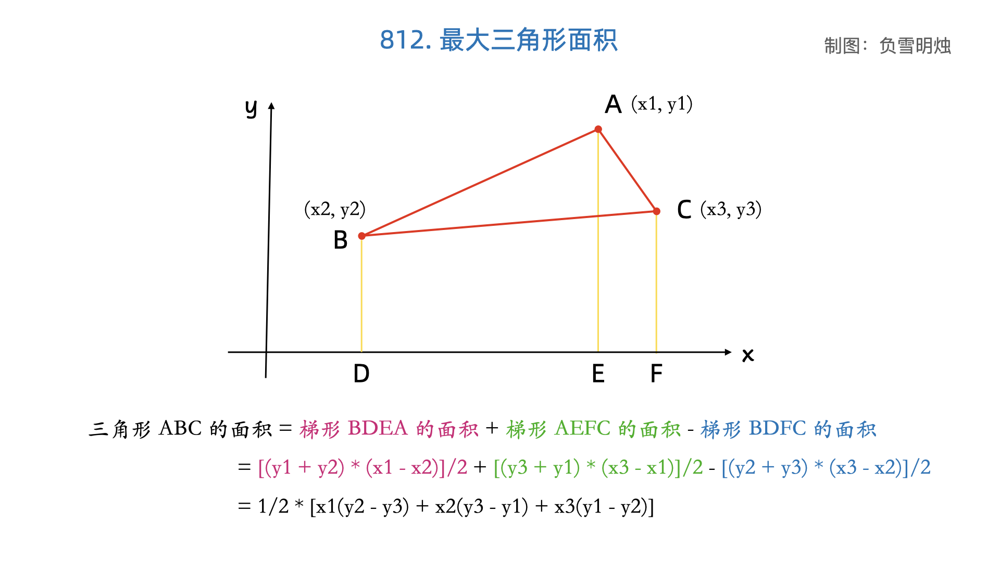
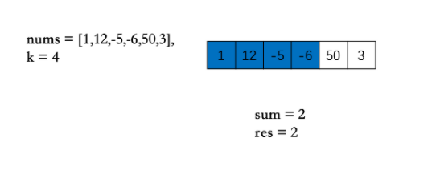
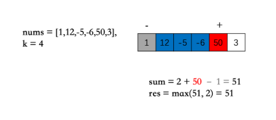
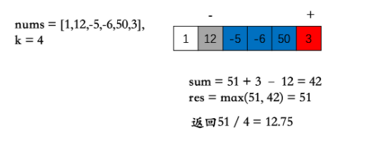
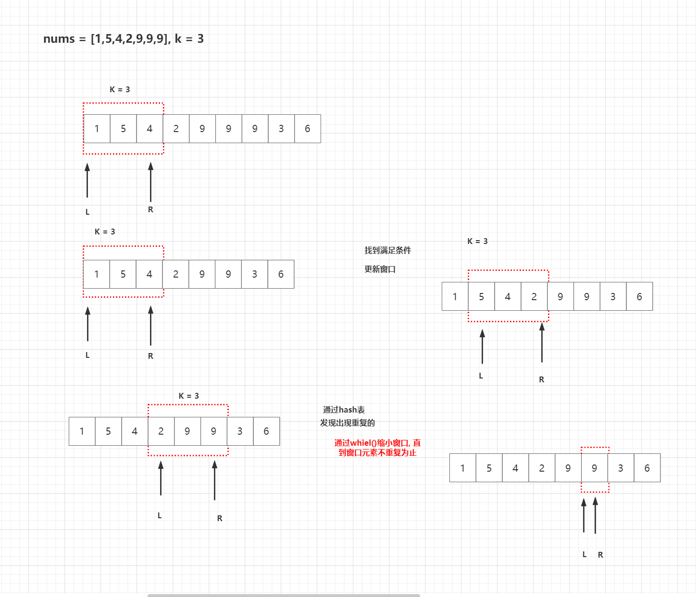
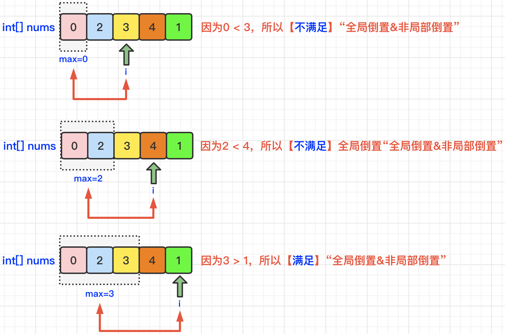
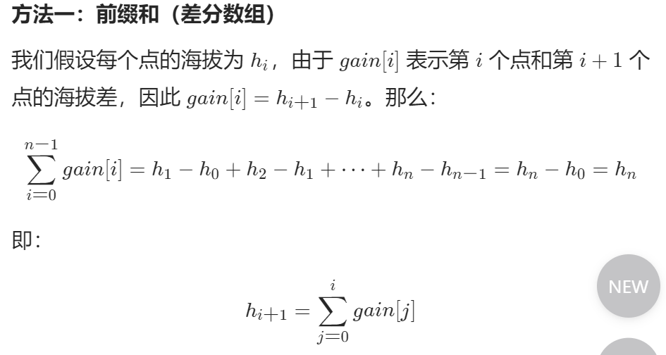
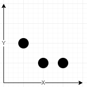

		# 	数组

**数组是存放在连续内存空间上的相同类型数据的集合。**

- **数组下标都是从0开始的。**
- **数组内存空间的地址是连续的**

**数组的元素是不能删的，只能覆盖。**

二维数组:


## 0. 常见的遍历形式

1.  **(n x m) 的所有坐标, 二维数组的遍历** 

```c++
#include <iostream>
#include <vector>
using namespace std;


int main ()
{
    // (n x m) 的所有坐标, 二维数组的遍历 
    int n = 5;
    int m = 5;  
    for (int i = 0; i < n; i++) 
    {
        for (int j = 0; j < m; j++)  // 每次循环的次数由外层的起始值决定
        {
            cout << "(" << i << "," << j << ")" << endl;
        }
        cout << "------" << endl;
    }

     return 0;
}
```


2. **每次循环的次数由外层的起始值决定**

```c++
#include <iostream>
#include <vector>
using namespace std;


int main ()
{
    // 每次循环的次数由外层的起始值决定
    int n = 5;
    for (int i = 0; i < n; i++) 
    {
        for (int j = 0; j < i; j++)
        {
            cout << "(" << i << "," << j << ")" << endl;
        }
        cout << "------" << endl;
    }
     return 0;
}
```


3. **[0, n)  的组合** 

```c++
#include <iostream>
#include <vector>
using namespace std;


int main ()
{

   // [0, n)  的组合 
    int n = 5;
    for (int i = 0; i < n; i++) 
    {
        for (int j = i; j < n; j++) 
        {
            cout << "(" << i << "," << j << ")" << endl;
        }
        cout << "------" << endl;
    }
     return 0;
}
```


4. **遍历数组中有三个元素组成的所有**

```c++
#include <iostream>
#include <vector>
using namespace std;


int main ()
{
    vector<vector<int>> points = {{0,0},{0,1},{1,0},{0,2},{2,0}};

       const int N = points.size();
        double res = 0;
        for (int i = 0; i < N - 2; i ++)   // 最多取到索引 N - 3
        {
            for (int j = i + 1; j < N - 1; j ++)   // 最多取到索引 N - 2, 从i + 1开始
            {
                for (int k = j + 1; k < N; k ++) 
                {
                    auto& point1 = points[i];
                    auto& point2 = points[j];
                    auto& point3 = points[k];
                    //
                    int x1 = point1[0], y1 = point1[1];
                    int x2 = point2[0], y2 = point2[1];
                    int x3 = point3[0], y3 = point3[1];
                    cout << x1 << y1 << " " ;
                    cout << x2 << y2  << " ";
                    cout << x3 << y3  << " \n" ;
                    cout << "--------------" << endl;

                }
            }
        }
     return 0;
}
```


例题: [812. 最大三角形面积](https://leetcode.cn/problems/largest-triangle-area/)

枚举



枚举三角形三个顶点并计算面积。

**三重 for循环，从题目给出的二维坐标中取出任意 3 个点**，根据上面的面积公式求组成的三角形面积。

```c++
class Solution {
public:
    double largestTriangleArea(vector<vector<int>>& points) {
        const int N = points.size();
        double res = 0;
        for (int i = 0; i < N - 2; i ++) 
        {
            for (int j = i + 1; j < N - 1; j ++) 
            {
                for (int k = j + 1; k < N; k ++) 
                {
                    // 找到3个点
                    auto& point1 = points[i];
                    auto& point2 = points[j];
                    auto& point3 = points[k];
                    //
                    int x1 = point1[0], y1 = point1[1];
                    int x2 = point2[0], y2 = point2[1];
                    int x3 = point3[0], y3 = point3[1];
                    res = max(res, 0.5 * abs(x1 * (y2 - y3) + x2 * (y3 - y1) + x3 * (y1 - y2)));
                }
            }
        }
        return res;
    }
};
```


## 1. 比较相邻的元素的方式

==**前提:  数组至少有两个元素**==

从前往后 :

```c++
for (int i = 1; i  < A.size(); i++)   // A中只有1个元素是不会进入
{
    // 前一个元素
    A[i - 1];
    // 后一个元素
    A[i];
}
```

  从后往前 :

```c++
for (int i = A.size() - 2; i >= 0; i--)  
{
    // 前一个元素
    A[i + 1];
    // 后一个元素
    A[i];
    
}
```

## 2. 单个字符相减解释

总结:

+ **0-9 数字字符 - ‘0’ 就得到了该数字。反之 + '0'的数字**   

+ **字母字符  - 'a' + 1得到对应的小写的26个英语的编号(1开始) **

+ **字母字符  - 'A'  + 1得到对应到大写的26个英语的编号 (A : 1  ,  B: 2)**
+ 同中字符之间相减得到数字(相当于索引相减),如'd' - 'a' = 3 

+ 反之得编号

+ ==**数字 大写字母 小写字母   ASCII  48 65 97**==

+ 小写字母转大写  也可以直接用函数   toupper(s[i])

  ```c++
  for(char &c : str) 
  {
      if(c <= 'z' && c >= 'a')  // 去除小写字符
      {// 不是小写
          c = c - 'a' + 'A';
      }
  } 
  ```


例子:

```c++
string s = "abcd";
for (int i = 0; i < 4; i++)
{
    int a = s[i] - 'a' + 1;
    cout << a;
}
结果:
1234
    
--------------------------
    
string s = "ABCD";
for (int i = 0; i < 4; i++)
{
    int a = s[i] - 'A' + 1;
    cout << a;
}

结果:
1234
```

## 3. 数组个数设置

总结:

+ **数组---> A[直接size()]    // cahr数组的size() - 1 是本身的个数**
+ **n---> A[n + 1]     //因为要访问到n**
+ **根据题的条件 ----> 一般+1    // 因为要访问到最大的值**

## 4. 对数组下标的理解

![ A  B C D E     F 0             1            2           3           4           5 墨迹绘图 第四个元素,  此时长度为4. 减 1 =  索引号 长度为3   墨迹绘图 墨迹绘图 ]()

+ **跨过长度 = 两下标之差**
+ 跨过的长度 --推出-> 循环次数  ===得到新的下标, 一般循环之后的长度
+ 索引 + 个数 = 个数

##**5. 数组中找出最值**

**找最大值用题意最小的数初始化**

```c++
#include<limits.h> 

int max = INT_MIN; /* 用最小值初始化 */
//或: 
int max = a[0];
// 或:
int max = 0;
1 <= fruits.length <= 105
0 <= fruits[i] < fruits.length

    
1 <= nums.length <= 10^5
1 <= nums[i] <= 10^5
int min = INT_MAX; /* 用最大值初始化 */
```

**以求最大值初始化要初始化成一个最小值，如果找不到确切的最小值，一般就用INT32_MIN**	

**这个最大值可以设置成情况里的一个值,也可以设置成情况外的值**

+ **1.情况外的值就是比情况中最小小于等于就行**

​			**对比来说 1需要看题意 题意给到的最小值的可能性**

+ **2.情况内的值就是随意啦找到一种情况给值就行了**

```
2的话 举个情况:
遍历数组的时候 随意元素
遍历子数组和  就是 随意子数组和
遍历 某种情况 .就是   符合某种情况的-一个随意值
但是 i 从下一个元素 开始比较, 因为有一个元素那来初始化了
```

+ **反正看需求嘛有时候1方便   有时候2方便.  但是大多数用1多点.**


##  思想:  滑动窗口

思想:   ==**就是不断的调节子序列的起始位置和终止位置，从而得出要想的结果**==


核心: 

+ 窗口内是什么
+ 如何移动窗口的起始位置
+ 如何移动窗口的结束位置

经典模板:

+ ```c++
  // int n =  数组长度,
  for(int 1 = 0, r = 0; r < n; ++r)
  {
      //右边滑入窗口
      
      // while(不符合条件)  左边滑出窗口(letf++):  窗口数据不满足要求的  // 一般和区间大小有关
  
  	if(/*满足条件*/） //记录
  }
  ```


### [209. 长度最小的子数组](https://leetcode.cn/problems/minimum-size-subarray-sum/description/)

给定一个含有 n 个正整数的数组和一个正整数 target 。

找出该数组中满足其和 ≥ target 的长度最小的 连续子数组 [numsl, numsl+1, ..., numsr-1, numsr] ，并返回其长度。如果不存在符合条件的子数组，返回 0 。

```c++
class Solution 
{
public:
    int minSubArrayLen(int target, vector<int>& nums) 
    {
        int result = INT32_MAX;
        int n = nums.size();
        int sum = 0; // 滑动窗口的数值和
        //int l = 0; // 滑动窗口的起始位置
        for (int l = 0, r = 0; r < n; r++)
        {
            sum += nums[r];
            while (sum - nums[l] >= target)
            {
                sum -= nums[l++]; // 左边界滑出窗口
            }
            
            int subLength = r - l + 1;
            if (sum >= target)
                result = result < subLength ? result : subLength;
        }
        // 如果result没有被赋值的话,就返回u,说明没有不存在符合条件的子数组
        return result == INT32_MAX ? 0 : result;
    }
};
```


### [643. 子数组最大平均数 I](https://leetcode.cn/problems/maximum-average-subarray-i/)

解题思路

+ **定义大小为 k 的窗口, 所以不用考虑不符合条件和符合条件的情况**
+ 定义窗口内的元素之和sum
+ 将sum的初值设置成 nums 中 0到 k - 1 位置的元素值之和
+ 当窗口向右滑动一步， sum 减去左侧离开窗口的元素， 加上右侧新进入窗口的元素
+ 记录窗口滑动过程中 sum 的最大值 maxSum
+ 最后返回 maxSum / k
  

```c++
class Solution 
{
public:
    double findMaxAverage(vector<int>& nums, int k) 
    {
        int n = nums.size();
        int sum = accumulate(nums.begin(), nums.begin() + k, 0);
        int res = sum;
        for (int l = 0, r = k; r < n; r++)
        {
            sum += nums[r] - nums[l++];
            res = max(res, sum);
        }
          return (double)res / k;
    }
};
```

### [674. 最长连续递增序列](https://leetcode.cn/problems/longest-continuous-increasing-subsequence/)

**示例 1：**

```
输入：nums = [1,3,5,4,7]
输出：3
解释：最长连续递增序列是 [1,3,5], 长度为3。
尽管 [1,3,5,7] 也是升序的子序列, 但它不是连续的，因为 5 和 7 在原数组里被 4 隔开。 
```


区间:

```c++
class Solution 
{
public:
    int findLengthOfLCIS(vector<int>& nums) 
    {
        int result = INT32_MIN;
        int count = 0;
        if (nums.size() == 1)
            return 1;
        for (int i = 1; i < nums.size(); i++)
        {
            if (nums[i] > nums[i - 1])
            { 
                count++;
            } 
            result = max(count, result); // 记录不同的区间值
            if (nums[i] <= nums[i - 1])
                count = 0;
        }
        return result + 1;
    }
};
```

思路; 双指针, 画图就行


```c++
class Solution 
{
public:
    int findLengthOfLCIS(vector<int>& nums)
    {
       
        int n = nums.size();
        int maxv = INT_MIN;
        int l, r;
        for(l = 0, r = 1; r < n; r++)
        {
            if(nums[r-1] >= nums[r] ) 
            {
                maxv = max(r - l, maxv);    
                l = r;   
            }
        }
        maxv = max(r - l,maxv);
        return maxv;
    }
};
```

滑动窗口::

的方法 有两个指针 l 和 r 然后让r去动 r每次都去判断是不是要小于他的下一个位置的数 如果是 r++ 否则就说明 这一段就是最长的就是这么长了 于是就可以让l和r一起跳到下一段了 然后为了防止这个数组是一个有序递增的数组 所以我们可以在最后加一个 maxv=max（maxv，r-l+1）作为判断

```c++
class Solution {
public:
    int findLengthOfLCIS(vector<int>& nums)
    {
        int l=0,r=0;
        int maxv=INT_MIN;
        while(r<nums.size()-1)
        {
            if(nums[r]<nums[r+1] )
            {
                r++;
            }
            else 
            {
                maxv=max(r-l+1,maxv);    
                l= r+1;
                r=r+1;
            }
        }
        maxv=max(r-l+1,maxv);
        return maxv;
    }
};

```


### [3. 无重复字符的最长子串](https://leetcode.cn/problems/longest-substring-without-repeating-characters/)

思路:


```c++
class Solution {
public:
    int lengthOfLongestSubstring(string s) 
    {
        int n = s.size();
        vector<int> count(128);  //count数组统计当前子串字符出现次数
        int maxLen = 0;
        for (int l = 0, r = 0; r < n; r++)
        {
            count[s[r]]++; // 右边划入
            while (count[s[r]] == 2)
            {
                count[s[l]]--;  // 去除重复的
                l++;  //左边滑出
            }
            maxLen = max(maxLen, r - l + 1);
        }
        return maxLen;
    }
};
```


### [6230. 长度为 K 子数组中的最大和](https://leetcode.cn/problems/maximum-sum-of-distinct-subarrays-with-length-k/)

给你一个整数数组 nums 和一个整数 k 。请你从 nums 中满足下述条件的全部子数组中找出最大子数组和：

子数组的长度是 k，且
**子数组中的所有元素 各不相同 。**
返回满足题面要求的最大子数组和。如果不存在子数组满足这些条件，返回 0 。

子数组 是数组中一段连续非空的元素序列

思路:   1. 子数组--->滑动  2. 不重复 ---> map



```c++
class Solution {
public:
    vector<long long> addvector(vector<int> nums)
    {
	    vector<long long>pre(nums.size()+1,0);
        // 保存每个位置累加前位置的值
        for(int i=0;i<nums.size();i++)
        {
            pre[i+1] = pre[i] + nums[i];
        }
        // [0 .......]
        return pre;
    }
    
    long long maximumSubarraySum(vector<int>& nums, int k) 
    {
        long long ans = 0;
        vector<long long> pre = addvector(nums);
        unordered_map<int, int> mp; 
        int n = nums.size();
        for(int l = 0, r = 0; r < n; ++r)
        {          
            //右边滑入窗口
            mp[nums[r]]++; 
            while(mp[nums[r]] >= 2)
            {  // 滑动窗口始终满足各元素各不相同
                mp[nums[l]]--;  //左边滑出窗口
                l++;
            }
            
            if(r - l + 1 >= k)  //r - l + 1滑块长度
            {               
                // 记录
                ans = max(ans, pre[l+k]-pre[l]);  // 得到最大和
                // 如果窗口长度大于等于k，我们再进行定长k的小窗口滑动
                // 更新窗口
                mp[nums[l]]--;
                l++;
            }
        }
        return ans;
    }
};
```


## 思想:区间找最值

这个区间不等于滑动窗口, 这个区间是不固定的，由一个相同的值确定!

例子1   在连续区间中找个最大值的区间 :

```c++
int result = 0;
int count = 0;
for (int n : nums)
{
    if (n == 1)
        count += n;
    result = max(count, result)// 记录不同的区间值
    
    if (n == 0)  // 不满足要求另起一个区间
        count = 0;
}
```


例子2  区间累计最大值 :

```c++
int result = INT32_MIN;
int count = 0;
for (int i = 0; i < nums.size(); i++)
{
    count += nums[i];
    if (count > result)
    { // 取区间累计的最⼤值（相当于不断确定最⼤⼦序终⽌位置）
    	result = count;
    } 
    // 因为连续和为负数只会拉低总和
    if (count <= 0) 
        count = 0; // 相当于重置最⼤⼦序起始位置，因为遇到负数⼀定是拉低总和
}
```


##  思想:  双指针法

思路: 一个移动一个留着覆盖

删除指定元素---> 双指针法

```c++
int slow = 0;
for (int first = 0; first < size; first++)
{
	if (date[first] != val)
    	data[slow++] = data[first];
}
```

删除指定位置---> 定位到要删除的位置, 然后 用后面的元素覆盖它

```c++
for (int k = pos; k < size; k++)
{
    data[k] = data[k + 1];
}
```


## 思想:  二分查找

分治思想:   快速排序归并排序二分查找

**当数据有序时,是非常快的**

记忆:   用left的结果会遇到left == len的情况,    left + (right - left) / 2;

+ 等于

  ```c++
  class Solution {
  public:
      int search(vector<int>& nums, int target) 
      {
          int len = nums.size();
          int left = 0, right = len - 1;
          while(left <= right)
          {
              int mid = left + (right - left) / 2;
              if (nums[mid] < target) 
                  left = mid + 1;
              else    
                  right = mid - 1;
          }
          return (left == len || nums[left] != target) ? -1 : left;
      }
  };
  
  
  class Solution {
  public:
      int search(vector<int>& nums, int target) 
      {
          int len = nums.size();
          int left = 0, right = len - 1;
          while(left <= right)
          {
              int mid = left + (right - left) / 2;
              if (nums[mid] < target) 
                  left = mid + 1;
              else if (nums[mid] > target)    
                  right = mid - 1;
              else
                  return mid;
          }
          return -1;
      }
  };
  ```

​	  

+ 大于等于

  ```c++
  class Solution {
  public:
      int search(vector<int>& nums, int target) 
      {
          int len = nums.size();
          int left = 0, right = len - 1;
          while(left <= right)
          {
              int mid = left + (right - left) / 2;
              if (nums[mid] >= target)  // 
                  right = mid - 1;
              else    
                  left = mid + 1;
          }
          return left == len ? -1 : left;
      }
  };
  ```


+ 大于

  ```c++
  class Solution {
  public:
      int search(vector<int>& nums, int target) 
      {
          int len = nums.size();
          int left = 0, right = len - 1;
          while(left <= right)
          {
              int mid = left + (right - left) / 2;
              if (nums[mid] > target)  // 
                  right = mid - 1;
              else    
                  left = mid + 1;
          }
          return left == len ? -1 : left;
      }
  };
  ```


+ 小于等于

  ```c++
  class Solution {
  public:
      int search(vector<int>& nums, int target) 
      {
          int len = nums.size();
          int left = 0, right = len - 1;
          while(left <= right)
          {
             int mid = left + (right - left) / 2;
             if (nums[mid] <= target) 
                  left = mid + 1;
              else    
                  right = mid - 1;
          }
          return right;
      }
  };
  ```


+ 小于

  ```c++
  class Solution {
  public:
      int search(vector<int>& nums, int target) 
      {
          int len = nums.size();
          int left = 0, right = len - 1;
          while(left <= right)
          {
             int mid = left + (right - left) / 2;
             if (nums[mid] < target) 
                  left = mid + 1;
              else    
                  right = mid - 1;
          }
          return right;
      }
  };
  ```

  

## 思想:  前缀和

核心思路是把**多个不同区间的问题，统一为相同类型的子问题**

- 具体而言，`[l,r]`区间的查询，左右两边界是不固定的，我们固定一边
- **问题转化为：`[l,r]`区间和  =`[0,r+1)`区间和 - `[0,l)`区间和**
  （所有`[0,i)`区间的和提前求出）

我们可以推广这种思想：把[左右界不固定的问题] 转化为两个 [左边界固定，右边界不定]的问题

**变种-求子数组数量问题：滑动窗口+前缀和思想**


[(10条消息) 算法学习笔记——常用技巧：滑动窗口与前缀和思想结合（求子数组数量问题）_Insomnia_X的博客-CSDN博客](https://blog.csdn.net/Insomnia_X/article/details/123153701)


如果是局部倒置，那么一定就是全局倒置。所以，全局倒置是包含局部倒置的。

那么我们就可以将解题视角放在非局部倒置的全局倒置上。换句话说，也就是—— **非相邻数字是否满足递增**。 具体操作如下图所示：



代码实现
1> 根据前缀的最大值来判断

```c++
class Solution 
{
public:
    // 非相邻数字是否满足单调
    bool isIdealPermutation(vector<int>& nums) 
    {
        int mx = nums[0];
        for (int i = 2; i < nums.size(); i++) 
        {
            if (nums[i] < mx)
            {// 满足全局倒置(递减)
                return false;
            } 
            mx = max(mx, nums[i - 1]);
        }
        return true;
    }
};
```


### [724. 寻找数组的中心下标](https://leetcode.cn/problems/find-pivot-index/)

解题思路
题目仅说明是整数数组，无其他已知条件，因此考虑直接遍历数组。

设索引 i 对应变量「左侧元素相加和 sum_left 」和「右侧元素相加和 sum_right 」。
遍历数组 nums ，每轮更新 sum_left 和 sum_right 。
遍历中，遇到满足 sum_left == sum_right 时，说明当前索引为中心下标，返回即可。
若遍历完成，仍未找到「中心下标」，则返回 -1 。
初始化时，相当于索引 i = - 1i=−1 ，此时 sum_left = 0 , sum_right = 所有元素的和 。

```c++
class Solution 
{
public:
    int pivotIndex(vector<int>& nums) 
    {
        int sumLeft = 0, sumRight = accumulate(nums.begin(), nums.end(), 0);
        for (int i = 0; i < nums.size(); i++) 
        {
            sumRight -= nums[i];
            // 若左侧元素和等于右侧元素和，返回中心下标 i
            if (sumLeft == sumRight)
                return i;
            sumLeft += nums[i];
        }
        return -1;
    }
};
```

```
输入：nums = [1, 7, 3, 6, 5, 6]
输出：3
```

思路
遍历一遍求出总和sum
遍历第二遍求中心索引左半和leftSum
同时根据sum和leftSum 计算中心索引右半和rightSum
判断leftSum和rightSum是否相同
C++代码如下：

```c++
class Solution {
public:
    int pivotIndex(vector<int>& nums) {
        int sum = 0;
        for (int num : nums) sum += num; // 求和
        int leftSum = 0;    // 中心索引左半和
        int rightSum = 0;   // 中心索引右半和
        for (int i = 0; i < nums.size(); i++) 
        {
            leftSum += nums[i];   // 多减了
            rightSum = sum - leftSum + nums[i];
            if (leftSum == rightSum) 
                return i;
        }
        return -1;
    }
};
```


### [661. 图片平滑器](https://leetcode.cn/problems/image-smoother/)

前缀和:

```c++
class Solution {
public:
    vector<vector<int>> imageSmoother(vector<vector<int>>& img) {
        int m = img.size();
        int n = img[0].size();

        vector<vector<int>> pre(m+1, vector<int>(n+1, 0));
        
        for (int i = 1; i <= m; i++) {
            for (int j = 1; j <= n; j++) {
                pre[i][j] = pre[i-1][j] + pre[i][j-1] - pre[i-1][j-1] + img[i-1][j-1];
            }
        }

        vector<vector<int>> ans(m, vector<int>(n, 0));

        for (int i = 0; i < m; i++) {
            for (int j = 0; j < n; j++) {
                int left = max(j-1, 0);
                int right = min(j+1, n-1);
                int top = max(i-1, 0);
                int bottom = min(i+1, m-1);

                int cnt = (bottom - top + 1) * (right - left + 1);
                int sum = pre[bottom+1][right+1] - pre[top][right+1] - pre[bottom+1][left] + pre[top][left];

                ans[i][j] = sum / cnt;
            }
        }

        return ans;
    }
};
```


**暴力:**

**在一个矩阵中小矩阵遍历**

```c++
//大矩阵 
for (int i = 0; i < m; i++) 
 {
     for (int j = 0; j < n; j++) 
     {
         int num = 0, sum = 0;
         // 3*3小矩阵遍历 (起止位置都右外层循环控制) // 遍历3次
         for (int x = i - 1; x <= i + 1; x++)  
         {
             for (int y = j - 1; y <= j + 1; y++) 
             {
                 if (x >= 0 && x < m && y >= 0 && y < n)  // 防止越界
                 {
                     cout << img[x][y];   // 小矩阵的每个元素
                 }
             }
         }

     }
```

**代码:**

```c++
class Solution 
{
public:
    vector<vector<int>> imageSmoother(vector<vector<int>>& img) 
    {
        int m = img.size();
        int n = img[0].size();
        vector<vector<int>> ret(m, vector<int>(n));
        for (int i = 0; i < m; i++) 
        {
            for (int j = 0; j < n; j++) 
            {
                int num = 0, sum = 0;
                // 3*3矩阵遍历 (起止位置都右外层循环控制)
                for (int x = i - 1; x <= i + 1; x++)   // 遍历3次
                {
                    for (int y = j - 1; y <= j + 1; y++) 
                    {
                        if (x >= 0 && x < m && y >= 0 && y < n)  // 防止越界
                        {
                            num++;
                            sum += img[x][y];
                        }
                    }
                }
                ret[i][j] = sum / num;
            }
        }
        return ret;
    }
};
```

#### [1732. 找到最高海拔](https://leetcode.cn/problems/find-the-highest-altitude/)



```c++
class Solution
{
public:
    int largestAltitude(vector<int>& gain)
    {
        int ans = 0, sum = 0;
        for (int x: gain) 
        {
            sum += x;
            ans = max(ans, sum);
        }
        return ans;
    }
};


```


## 重复

### [26. 删除有序数组中的重复项](https://leetcode.cn/problems/remove-duplicates-from-sorted-array/description/)

解题思路:

+ 因为升序排列,所以重复项直接跨过

```c++
class Solution {
public:
    int removeDuplicates(vector<int>& nums) 
    {
      int p, q = 0;
      int len = nums.size();

      for (p = 0; p < len; ++p)
      {
          if (p == 0 ||  nums[p] != nums[p-1])
          { 
            nums[q] = nums[p];
            ++q;
          }
      }
    return q;
    }
};
```

### [217. 存在重复元素](https://leetcode.cn/problems/contains-duplicate/description/)

给你一个整数数组 `nums` 。如果任一值在数组中出现 **至少两次** ，返回 `true` ；如果数组中每个元素互不相同，返回 `false` 。

```c++
class Solution 
{
public:
    bool containsDuplicate(vector<int>& nums) 
    {
        unordered_map<int, int> count;
        for (int n : nums)
            ++count[n];
        for (auto [_, stn] : count)
        {
            if (stn >= 2)
                return true;
        }
        return false;
    }
};
```

### 除去重复保留顺序

思路: find函数

```c++
vector<int>& nums = {1, 2, 2, 4, 5 4, 6};
vector<int> hehe;
vector<int>::iterator it1, it2;  
for (it1 = nums.begin(); it1 < nums.end(); it1++)
{
    it2 = find(nums.begin(), it1, *it1);   //  参数1,2: 位置  参数3: 值
    if (it2 == it1)
    	continue;
    hehe.push_back(*it1);               
}
```


[645. 错误的集合](https://leetcode.cn/problems/set-mismatch/)

集合 s 包含从 1 到 n 的整数。不幸的是，因为数据错误，导致集合里面某一个数字复制了成了集合里面的另外一个数字的值，导致集合 丢失了一个数字 并且 有一个数字重复 。

**法1:**

解题思路:: 

+ 又是查缺 + 查重。

​          对于重复的元素，可以直接用哈希查出来（当然不要用哈希， 因为此题不需要离散化处理，选用flag标记）

​          对于缺失的元素，可以直接用数学的方法算出来：根据等差数列和——(n + 1) * n / 2求出本来的和，再减去现在的sum，加上重复元素即可求出缺失元素。 即：los = (n + 1) * n / 2 - (sum - rep)

flag标记 + 数学

```c++
class Solution {
public:
    vector<int> findErrorNums(vector<int>& nums) {
        const int n = nums.size();
        int los = -1, rep = -1, sum = 0;
        bool flag[n + 1];
        memset(flag, false, sizeof(flag));  //flag标记
        for(int num: nums){
            sum += num;          //记录总和
            if(flag[num]) rep = num;  //找出那个重复的元素
            else flag[num] = true;
        }
        los = (((n + 1) * n) >> 1) - sum + rep;  //数学算出丢失的元素
        return vector<int>{rep, los};
    }
};
```

**法 2:** 

hash + + 数学

```c++
class Solution {
public:
    vector<int> findErrorNums(vector<int>& nums) 
    {
        unordered_map<int, int> count;
        vector<int> result;
        int sum = 0;
        for (int &n : nums)
        {
            sum += n;
            ++count[n];
        }
            
        for (auto [num, stn] : count)
        {
            if (stn >= 2)
                result.push_back(num);
        }

        int los = (((nums.size() + 1) * nums.size()) >> 1) - sum + result[0]; 
        result.push_back(los);

        return  result;
    }
};
```

**法3:** 

```c++
class Solution {
public:

vector<int> findErrorNums(vector<int>& nums)
{
    //1-n映射到0-n-1
    int pos;
    vector<int> ans(2);
    for(int i = 0; i < nums.size(); i++) {
        pos = (nums[i]-1) % nums.size();
        nums[pos] += nums.size();
    }
    //寻找>2n和小于n的数
    for(int i = 0; i < nums.size(); i++) {
        if(nums[i] <= nums.size()) {
            ans[1] = i+1;
        }else if(nums[i] > 2 * nums.size()){
            ans[0] = i+1;
        }
    }
    return ans;
}
};
```


## 枚举

枚举，顾名思义，就是用最笨的方法，去解决问题（暴力枚举），一个集的枚举是列出某些有穷序列集的所有成员的程序，或者是一种特定类型对象的计数。这两种类型经常（但不总是）重叠。

枚举算法是我们在日常中使用到的最多的一个算法，它的核心思想就是:   枚举所有的可能

枚举法的本质就是从所有候选答案中去搜索正确的解,使用该算法需要满足两个条件：

+ (1)可预先确定候选答案的数量；
+ (2)候选答案的范围在求解之前必须有一个确定的集合。

#### [6224. 最大公因数等于 K 的子数组数目](https://leetcode.cn/problems/number-of-subarrays-with-gcd-equal-to-k/)

枚举

1. __gcd(x,y)是algorithm库中的函数

```c++
class Solution 
{
public:
    int subarrayGCD(vector<int>& nums, int k) 
    {
        int n = nums.size();
        int ans = 0;
        // 枚举子数组的起点
        for (int i = 0; i < n; i++) 
        {
            int g = nums[i];
            // 枚举子数组的终点
            for (int j = i; j < n; j++) 
            {
                // 计算最大公因数
                g = __gcd(g, nums[j]);  // 计算最大公因子
                if (g == k) 
                    ans++;
                else if (g < k) 
                    break;
            }
        }
        return ans;
    }
};
```

#### [2447. 最大公因数等于 K 的子数组数目](https://leetcode.cn/problems/number-of-subarrays-with-gcd-equal-to-k/)

 g = g * nums[j] / __gcd(g, nums[j]); 

```c++
class Solution {
public:
    int subarrayGCD(vector<int>& nums, int k) 
    {
        int n = nums.size();
        int ans = 0;
        // 枚举子数组的起点
        for (int i = 0; i < n; i++) 
        {
            int g = nums[i];
            // 枚举子数组的终点
            for (int j = i; j < n; j++) 
            {
                // 计算最大公因数
                g = g * nums[j] / __gcd(g, nums[j]);  
                if (g == k) 
                    ans++;
                else if (g < k) 
                    break;
            }
        }
        return ans;
        
    }
};
```


#### [816. 模糊坐标](https://leetcode.cn/problems/ambiguous-coordinates/)

任务1： 使用“逗号”和“小数点”符号来拆分原有数字，使其成为有效坐标。


任务2：对于不合法的数字，要过滤掉。
规则判断：

【整数部分】不允许以0开头，除非这个整数就是0本身。
【小数部分】不允许以0结尾。

```c++
class Solution {
public:
    vector<string> ambiguousCoordinates(string s) 
    {
        int n = s.size();
        vector<string> ans;
        // 表达式 //对于不合法的数字，要过滤掉。
        auto f = [&](int i, int j) 
        {
            vector<string> res;
            for (int k = 1; k <= j - i; ++k) 
            {
                string l = s.substr(i, k);
                string r = s.substr(i + k, j - i - k);
                if ( (l == "0" || l[0] != '0') && r.back() != '0') 
                {
                    res.push_back(l + (k < j - i ? "." : "") + r);
                }
            }
            return res;
        };
        
        // 使用“逗号”和“小数点”符号来拆分原有数字，使其成为有效坐标。
        for (int i = 2; i < n - 1; ++i)
        {
            for (auto& x : f(1, i)) 
            {
                for (auto& y : f(i, n - 1)) 
                {
                    ans.emplace_back("(" + x + ", " + y + ")");
                }
            }
        }
        return ans;
    }
};
```

法2:

```c++
class Solution {
public:
    vector<string> getPos(string s) {
        vector<string> pos;
        if (s[0] != '0' || s == "0") pos.push_back(s); //【整数部分】不允许以0开头，除非这个整数就是0本身。
        for (int p = 1; p < s.size(); ++p) 
        {
            if ((p != 1 && s[0] == '0') || s.back() == '0') 
                continue;  // 【小数部分】不允许以0结尾。
            pos.push_back(s.substr(0, p) + "." + s.substr(p)); 
        }
        return pos;
    }
    vector<string> ambiguousCoordinates(string s) 
    {
        int n = s.size() - 2;
        vector<string> res;
        s = s.substr(1, s.size() - 2);
        for (int l = 1; l < n; ++l) 
        {
            vector<string> lt = getPos(s.substr(0, l));  //[0, L]
            if (lt.empty()) continue;
            vector<string> rt = getPos(s.substr(l));     //[L, end]
            if (rt.empty()) continue;
            for (auto& i : lt) {
                for (auto& j : rt) {
                    res.push_back("(" + i + ", " + j + ")");
                }
            }
        }
        return res;
    }
};

```


##  交换, 反转和排序

### **交换**

+ 使用stl,  有swap()函数就直接用swap()函数

+ 其他

  方式1:

  ```c++
  void swap(int *a, int *b)
  {
      int tmp = *a;
      *a = *b;
      *b =tmp;
  }  
  ```

  方式2:

  ```c++
  void swap(int& a, int& b)
  {
  	a ^= b;
  	b ^= a;
  	a ^= b;
  }
  ```

### 反转

+ 使用stl, 有reverse()函数就直接用reverse()函数

+ 其他

+ reverse(a, a+n);                           //n为数组中的元素个数
  reverse(str.begin(), str.end());    // 翻转字符串

+ 数字的反转用这个

  ```c++
  // -123 反转 -
  int reverse(int a)
  {
      int b=0;
      while(a)
      {
          b = b*10 + a%10;
          a/=10;
      }
      return b;
  }
  ```

### 排序

+ 使用stl, 有srot()函数就直接用srot()函数

+ 例子

  ```c++
  bool compare(int a,int b) 
  { 
      return a< b; //升序排列，如果改为return a>b，则为降序 
  } 
  int a[20]={2,4,1,23,5,76,0,43,24,65}, i; 
  for(i=0;i<20;i++) 
      cout<< a[i]<< endl; 
  sort(a,a+20,compare);
  ```

+ ```c++
  // 自定义的要求排序  从大到小排
  static bool cmp(const vector<int> a, const vector<int> b)
  {
      if (a[0] == b[0]) return a[1] < b[1];  //  如果第一个位置相等就比较第二个位置
      return a[0] > b[0];  // 这里改一下还能按绝对值大小排abs(a) > abs(b)
  }
  sort (people.begin(), people.end(), cmp);   //
  
  // 或者 sort (people.rbegin(), people.rend());   //
  ```
  


#### [2471. 逐层排序二叉树所需的最少操作数目](https://leetcode.cn/problems/minimum-number-of-operations-to-sort-a-binary-tree-by-level/)

置换环得到数组排序需要的最小交换次数
置换环的思想为 ： 对每个节点，将其指向其排序后应该放到的位置，直到首位相接形成了一个环。

具体实现思想：

+ 使用 Map 哈希表记录每个节点值以及其应该放到的位置
+ 从头到尾遍历初始数组，使用 flag[] 数组标记当前元素是否已经参与过（即已经被加入环中），对已经参与过的数组则不再需要遍历。每次成环结束，记录成环个数 loop。
+ 最终最小交换次数为 ：数组长度 - 成环个数 nums.size() - loop

以计算使得 [7, 6, 8, 5] 严格递增需要的最小交换次数为2 ，画出置换环算法图解如下


代码:

```c++
class Solution
{
public:

    int levelorder(TreeNode* root)
    {
        queue<TreeNode*> que;
        if (root != NULL)
            que.push(root);
        
        int result = 0;
        while (!que.empty())
        {
            int size = que.size(); 
            vector<int> vec;
            for (int i = 0;  i< size; i++)
            {
                TreeNode* node = que.front();                
                que.pop(); 
                vec.push_back(node->val);
                if (node->left) que.push(node->left);     
                if (node->right) que.push(node->right);  
            }
           result += minChanges(vec);
         }
         return result;
    }
        
    //  置换环
    int minChanges(vector<int> v)
    {
        // 1.使用 Map 哈希表记录每个节点排序后的的位置
        vector<int> copy(v);
        sort(copy.begin(), copy.end());
        unordered_map<int, int> map;
        for(int i = 0; i < copy.size(); i++)
        {
            map[copy[i]] = i;
        }

        vector<bool> flag(v.size(), 0);  // 用于标记 nums[i] 是否已经被加入环中

        int loop = 0; // 环的个数
        //置换环
        for(int i = 0; i < v.size(); i++)
        {
            if(!flag[i])
            {
                int j = i;
                while(!flag[j])
                { // 画环
                    int index = map[v[j]]; // 当前节点排序后指向的位置，画环过程
                    flag[j] = true; // 将 j 加入环中
                    j = index; // 将当前节点移动到环上下个节点
                }
                loop++; // 环数递增
            }
        }
        return v.size() - loop; // 最小交换次数为 ： 数组长度 - 环数
    }


    int minimumOperations(TreeNode* root) 
    {
        return levelorder(root);
    }
};
```


##  其他

#### [696. 计数二进制子串](https://leetcode.cn/problems/count-binary-substrings/)

```c++
class Solution {
public:
    int countBinarySubstrings(string s) 
    {
        int pre = 0;    // 前一个字符出现的次数
        int cur = 1;    // 当前的字符出现的次数
        int ans = 0;    // 满足要求的子串的个数
        for(int i = 0; i < s.length()-1; ++i) 
        {
            if(s[i] == s[i+1]) 
            {
                ++cur;
            }
            else               
            {
                pre = cur; 
                cur = 1;
            }
            // 前一个字符个数 >= 当前字符个数时，就找到一个答案
            if (pre >= cur) 
            {
                ++ans;
            }
        }
        return ans;
    }
};

```


#### [717. 1 比特与 2 比特字符](https://leetcode.cn/problems/1-bit-and-2-bit-characters/)

有两种字符串，一种是 `0`，一种是 `10` 或 `11`。即一种长度是1，一种长度是2.

所以找个指针然后遍历一遍：

- 遇到 `0` 走一步；
- 遇到 `1`走两步。
- 

```c++
class Solution 
{
public:
    bool isOneBitCharacter(vector<int>& bits) 
    {
        int N = bits.size();
        int pos = 0;
        while (pos < N - 1) 
        {
            pos += bits[pos] == 1 ? 2 : 1;
        }
        return pos == N - 1;
    }
};
```

#### [747. 至少是其他数字两倍的最大数](https://leetcode.cn/problems/largest-number-at-least-twice-of-others/)

找到最大和第二大，然后判断最大是否是第二的2倍。

```c++
class Solution 
{
public:
    int dominantIndex(vector<int>& nums) 
    {
        int one = 0;
        int two = 0;
        int index = 0;
        for(int i = 0;i<nums.size();++i)
        {
            if(nums[i] > one)
            {
                two = one;       // 前一个
                one = nums[i];   // 更新当前
                index = i;      // 记录
            }
            else if(nums[i] > two)  // 第二大
            {
                two = nums[i];
            }
        }
        return one>=two*2?index:-1;
    }
};
```

```
输入：nums = [3,6,1,0]
输出：1
解释：6 是最大的整数，对于数组中的其他整数，6 至少是数组中其他元素的两倍。6 的下标是 1 ，所以返回 1 。
```


#### [766. 托普利茨矩阵](https://leetcode.cn/problems/toeplitz-matrix/)


```c++
class Solution 
{
public:
    bool isToeplitzMatrix(vector<vector<int>>& matrix) 
    {
        for (int i = 0; i < matrix.size() - 1; ++i) 
        {
            for (int j = 0; j < matrix[0].size() - 1; ++j) 
            {
                if ( matrix[i][j] != matrix[i + 1][j + 1] )
                    return false;
            }
        }
        return true;
    }
};
```


#### [806. 写字符串需要的行数](https://leetcode.cn/problems/number-of-lines-to-write-string/)

```c++
class Solution 
{
public:
    vector<int> numberOfLines(vector<int>& widths, string S) 
    {
        vector<int> result;
        int count = 1;
        int temp = 0;
        for(char c : S)
        {
            if(temp+widths[c-'a']>100)
            {
                count++;
                temp = widths[c-'a'];  //  写到下一行
            }
            else
                temp += widths[c-'a'];
        }

        // result.push_back(count);
        // result.push_back(temp);
        return {count, temp};
    }
};
```

#### [1620. 网络信号最好的坐标](https://leetcode.cn/problems/coordinate-with-maximum-network-quality/)

给你一个数组 towers 和一个整数 radius 。

**数组  towers**  中包含一些网络信号塔，其中 towers[i] = [xi, yi, qi] 表示第 i 个**网络信号塔的坐标是 (xi, yi) 且信号强度参数为 qi** 。所有坐标都是在  X-Y 坐标系内的 整数 坐标。两个坐标之间的距离用 欧几里得距离 计算。

**整数 radius** 表示一个塔 能到达 的 最远距离 。如果**一个坐标跟塔的距离在 radius 以内**，那么该塔的信号可以到达该坐标。在这个范围以外信号会很微弱，所以 radius 以外的距离该塔是 不能到达的 。

如果第 i 个塔能到达 (x, y) ，那么**该塔在此处的信号为 ⌊qi / (1 + d)⌋ ，其中 d 是塔跟此坐标的距离。一个坐标的 信号强度 是所有 能到达 该坐标的塔的信号强度之和**

请你返回数组 [cx, cy] ，表示 信号强度 最大的 整数 坐标点 (cx, cy) 。如果有多个坐标网络信号一样大，请你返回字典序最小的 非负 坐标。

注意：

坐标 (x1, y1) 字典序比另一个坐标 (x2, y2) 小，需满足以下条件之一：
要么 x1 < x2 ，
要么 x1 == x2 且 y1 < y2 。
⌊val⌋ 表示小于等于 val 的最大整数（向下取整函数）。

1 <= towers.length <= 50
towers[i].length == 3
0 <= xi, yi, qi <= 50
1 <= radius <= 50

**示例 1：**



输入：towers = [[1,2,5],[2,1,7],[3,1,9]], radius = 2
输出：[2,1]
解释：
坐标 (2, 1) 信号强度之和为 13

- 塔 (2, 1) 强度参数为 7 ，在该点强度为 ⌊7 / (1 + sqrt(0)⌋ = ⌊7⌋ = 7

- 塔 (1, 2) 强度参数为 5 ，在该点强度为 ⌊5 / (1 + sqrt(2)⌋ = ⌊2.07⌋ = 2

- 塔 (3, 1) 强度参数为 9 ，在该点强度为 ⌊9 / (1 + sqrt(1)⌋ = ⌊4.5⌋ = 4
  没有别的坐标有更大的信号强度。

   *欧式距离计算公式是0ρ = sqrt( (x1-x2)^2^*+(y1-y2)^2^ )。

  

思路:
+ 暴力法，遍历取最大值就是结果

+ 遍历整个坐标系, 计算坐标的信号强度, 返回信号强度的最大 坐标

```c++
class Solution 
{
public:
    vector<int> bestCoordinate(vector<vector<int>>& towers, int radius) 
    {
        int n = towers.size();
        double currMax = 0.0;
        vector<int> res = {0, 0};
        for (int x = 0; x <= 50; ++x)
        {
            for (int y = 0; y <= 50; ++y)
            {
                double curr = 0.0;
                for (vector<int>& tower : towers)
                {
                    int x1 = tower[0];
                    int y1 = tower[1];
                    int q = tower[2];
                    //double d = pow((x-x1)*(x-x1)+(y-y1)*(y-y1), 0.5);  //开方
                    double d = sqrt((x-x1)*(x-x1)+(y-y1)*(y-y1));
                    if (d <= (double)radius) // 信号能到达该点
                    {
                        curr += floor((double)q / (1+d));
                    }
                }

                if (curr > currMax)
                {
                    currMax = curr;
                    res = {x, y};   // 有更大的信号强度就更新
                }
            }
        }
        return res;
    }
};
```


#### [2443. 反转之后的数字和](https://leetcode.cn/problems/sum-of-number-and-its-reverse/)

```c++
class Solution {
public:
    int f(int a){
        int b=0;
        while(a){
            b = b*10 + a%10;
            a/=10;
        }
        return b;
    }

    bool sumOfNumberAndReverse(int num) 
    {
        int sum=0;
        bool flag = false;
        if(num == 0)
        {
            return true;
        }
        else
        {
            for(int i=0;i<num;i++)
            {
                sum = i+f(i);
                if(sum == num){
                    return true;
                }
            }
        }
        return false;
    }
 };
```

法二:

```
class Solution 
{
public:
    bool sumOfNumberAndReverse(int num) 
    {
        int sum=0;
        if(num == 0)
        {
            return true;
        }
        else
        {
            for(int i = 0; i < num; i++)
            {
                string str = to_string(i);
                reverse(str.begin(), str.end()); 
                sum = i + stoi(str);
                if(sum == num)
                {
                    return true;
                }
            }
        }
        return false;
    }
};
```


# 数的操作

##  1. 每次循环得到每个位上的数

模板:

```c++
while(n) 
{ 
    int ans = n%10;  
    /*得到结果8*/
    n/=10;          
}
```


```c++
int n = 13;
while(n)   // 数的起始条件  如数是大于1的就写n>1
{ 
    int d = n%10;    //得到各个位上的数  **%是就是整除的意思**
    cout<< d <<" ";
    n/=10;           // 十位数的个位数
}

// 3 1
```

注意:

+ 判断整除用到是%

+ 周期 是T:  **n % T**满足周期的余数为0

####  [415. 字符串相加](https://leetcode.cn/problems/add-strings/)

```c++
class Solution {
public:
    string addStrings(string num1, string num2)
    {    
        int i = num1.length() - 1, j = num2.length() - 1, add = 0;
        string ans = "";
        while (i >= 0 || j >= 0 || add != 0)
        {
            // 没有的位用0
            int x = i >= 0 ? num1[i] - '0' : 0;
            int y = j >= 0 ? num2[j] - '0' : 0;
            int result = x + y + add;
            ans.push_back('0' + result % 10);
            add = result / 10;
            i -= 1;
            j -= 1;
        }
        // 计算完以后的答案需要翻转过来
        reverse(ans.begin(), ans.end());
        return ans;
    }
};
```


#### [6222. 美丽整数的最小增量](https://leetcode.cn/problems/minimum-addition-to-make-integer-beautiful/)

思路:   得到数的每个位上的数  + 模拟进位

```c++
class Solution 
{
private:
    int getSum(vector<int> &A)
    {
        int sm = 0;
        for (int x : A)
            sm += x;
        return sm;
    }

public:
    long long makeIntegerBeautiful(long long n, int target) 
    {
        vector<int> A;
        while(n)  
        {
            int num = n%10;   
            A.push_back(num);
            n/=10;
        }
        A.push_back(0);   // 多加入一个保证,数组元素大于等于2
        // 先检查答案是不是 0
        if (getSum(A) <= target) 
            return 0;
        
        // 模拟进位过程，现在是从右往左第 i 位进位, 每进位一次进行判断,
        long long ret = 0, bit = 1;
        for (int i = 1; i  < A.size(); i++, bit *= 10)   //注意: A中只有1个元素不会进入
        {
            ret += (10 - A[i - 1]) * p;
            // 进位后，该位变成 0
            A[i - 1] = 0;
            // 进位后，下一位增加 1
            A[i]++;
            // 下一位已经超过了 9，会继续自动向下进位，先不要计算答案
            if (A[i] == 10) 
                continue;
            // 判断是否符合要求
            if (getSum(A) <= target) 
                return ret;
        }   
        return ret;    
    }
};
```

## 2.任意2-36进制数转化为10进制数。

```c++
int Atoi(string s,int radix)    //s是给定的radix进制字符串
{
	int ans=0;
	for(int i=0;i<s.size();i++)
	{
		char t=s[i];
		if(t >= '0'&& t <= '9') 
            ans = ans * radix + t - '0'; // 字符转数字
		else
        {
            ans = ans * radix + t -'a' + 10;  //字符转数字
        } 
	}
	return ans;
}
```

## 2.1 10进制转R进制模板


```c++
10转R进制模板
    负整数使用补码运算方法，上方的代码不适用
     
class Solution {
public:
    string convertToBase7(int num) {
        return tenToR(num, 7);
    }
private:
    const string words = "0123456789abcdef";  //第0个元素’0’。这个技巧常常用在进制转换中
    
    string tenToR(int num, const int R) {
        // 特判0
        if (num == 0) {
            return "0";
        }
        // 处理负数
        long long n = num;
        string flag;
        if (n < 0) {
            flag = "-";
            n = -n;      //变相反数变成正数处理
        }

        string s;
        while(n) 
        {
            int idx = n % R;
            s += words[idx];   // 通过索引,而不是函数转成数字或者+'0',进制转换的技巧
            n /= R;         // R=2则写成 n >>= 1; 
        }
        
        reverse(s.begin(), s.end());  //反转

        return flag + s;
    }
};
```

栈的应用:十进制转换为二进制

**和上面相同思想**

```c++
while (num)
{
    push((num & 1);
    nums >>= 1;
}
```

补充:

```c++
while(num)       //为0刚好是满足循环终止的条件 也是 10-->2 的终止条件
{
    push(num % 2); //余数入栈
    num /= 2;
}
```


## 3. 一个数能被分解成  n1, n2, ..的乘积

```c++
vector<int> factors = {2, 3, 5};

for (int factor : factors) 
 {
        while (n % factor == 0) 
        {
            n /= factor;
        }
}
return n == 1;
```

## 4. 一个数的所有因式

```javascript
int num = 28;
int sum = 1;
for (int i = 1; i <= sqrt(num); i++)   // 核心   从1开始   <=sqrt()
{
    if (num % i == 0) 
    {
        // 处理因式1
        sum += i;
        cout << i << endl;   
        if (num/i != i)      //两个因子数不相等
        {
            //处理因式2
            sum += num / i;
            cout << num / i << endl; 
        }
    }
}}
```

> 运行结果如下：

```javascript
1
28

2
14

4
7
```

+  a所有因子数的总个数 

```c++
int ans=0;     //ans是求a所有因子数的总个数 
for(int i=1; i*i <= a; i++)   // i <= sqrt(num)
{     
    if(a%i==0) 
    {   
         ans++;
         if(i != a/i) {     //两个因子数不相等
          ans++;
    }
}
```

## 5. x的幂

```c++
class Solution 
{
public:
    bool isPowerOfTwo(int n) 
    {   // n为正整数
        while(n>1)
        {
            if(n % x != 0)  //n % 2 != 0
                return false;
            n /= x;  // n /= 2  //更新
        }
        return n == 1;     
    }
};
```

####  [231. 2 的幂](https://leetcode.cn/problems/power-of-two/)

```c++
class Solution 
{
public:
    bool isPowerOfTwo(int n) 
    {   // n为正整数
        while(n>1)
        {
            if((n & 1) != 0)  //n % 2 != 0
                return false;
            n >>= 1;  // n /= 2  //更新
        }
        return n == 1;     
    }
};
```

## 6.  指数,对数函数

**log()函数**

相当于数学的ln

另外如果自定义以m为底，求log n的值

```c++
//需要double a=log(n)/log(m);
```

**pow()函数**

```
double pow(double x, double y)
```

```c++
#include <stdio.h>
#include <math.h>

int main ()
{
   printf("值 8.0 ^ 3 = %lf\n", pow(8.0, 3));

   printf("值 3.05 ^ 1.98 = %lf", pow(3.05, 1.98));
   
   return(0);
}
```


## 7. 质数

```c++
#include <iostream>
#include <vector>
using namespace std;

int main()
{
	int MAX;
	cin >> MAX;
	vector<char> isPrime(MAX + 10, 1);//先将所有元素都认为是素数
	vector<int> ans;
	for (int i = 2; i <= MAX; ++i)
	{
		if (isPrime[i]) //只用标记素数的倍数
			for (int j = i * 2; j <= MAX; j += i)
				isPrime[j] = 0;	//将其标记为非素数
	}
	for (int i = 2; i <= MAX; ++i) //依次输出素数
		if (isPrime[i])
			ans.push_back(i);
	cout << ans.size() << endl;
	for (auto n : ans)
	{
		cout << n << endl;
	}
	return 0;
}
```


